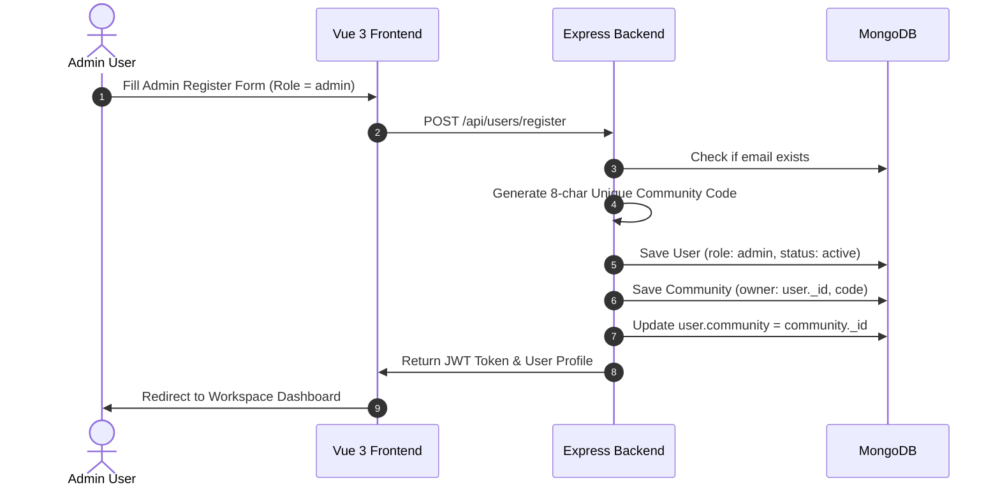
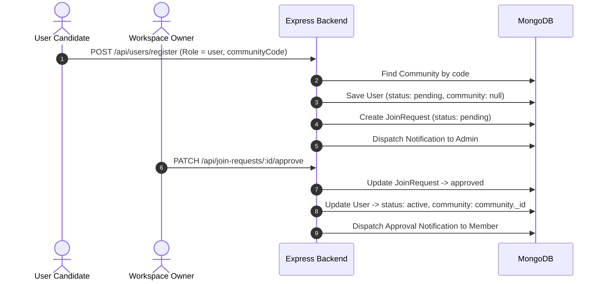

# 📘 SmartMeet — Comprehensive Technical Documentation Manual

Welcome to the official technical documentation manual for **SmartMeet**. This document serves as the authoritative engineering guide detailing the system architecture, database entity relationships, business workflows, REST API endpoints, real-time WebSocket protocol, speech-to-text microservices, RAG AI pipeline, security, and deployment strategies.

---

## 📋 Table of Contents

1. [Architectural Overview & Design Principles](#1-architectural-overview--design-principles)
2. [Database Entities & Data Models](#2-database-entities--data-models)
3. [Core Business Logic & Workflows](#3-core-business-logic--workflows)
4. [Complete REST API Specification](#4-complete-rest-api-specification)
5. [Real-Time WebSocket Protocol (Socket.IO)](#5-real-time-websocket-protocol-socketio)
6. [Speech-to-Text Microservice & RAG Pipeline](#6-speech-to-text-microservice--rag-pipeline)
7. [Authentication, Security & Session Management](#7-authentication-security--session-management)
8. [Environment Variables Reference](#8-environment-variables-reference)
9. [Deployment & Production Guidelines](#9-deployment--production-guidelines)

---

## 1. Architectural Overview & Design Principles

SmartMeet is designed as a **multi-tenant workspace collaboration platform** operating under strict data isolation boundaries. 

### Key Architectural Layers

```
+-----------------------------------------------------------------------+
|                            PRESENTATION LAYER                         |
|  Vue 3 Single Page Application (Vite + Tailwind CSS + Pinia + Axios)  |
+-----------------------------------------------------------------------+
                                    | (REST API / WebSockets)
                                    v
+-----------------------------------------------------------------------+
|                            APPLICATION LAYER                          |
|    Express 5.x REST API Engine  <--->  Socket.IO WebSockets Engine    |
|   (Controllers, Auth Middleware, Task Workflows, Notification Engine) |
+-----------------------------------------------------------------------+
          |                         |                        |
          | (Mongoose ORM)          | (HTTP / Multipart)     | (REST API / Vector SDK)
          v                         v                        v
+------------------+     +--------------------+    +--------------------+
| DATA PERSISTENCE |     | STT MICROSERVICE   |    |    AI & RAG ENGINE |
| MongoDB Cluster  |     | Python FastAPI +   |    | Pinecone Vector DB |
| (15 Collections) |     | Faster-Whisper STT |    | Groq LLM / Gemini  |
+------------------+     +--------------------+    +--------------------+
```

### Core Design Rules
1. **Absolute Multi-Tenancy**: Data is scoped logically by `community` (Workspace ObjectId). Every database query for workspace resources (Tasks, Meetings, Transcripts, Documents, Notifications, Members) MUST filter by `community: req.user.community`. Cross-community data leaks are impossible by design.
2. **Asynchronous Processing**: Heavy ML compute tasks (speech-to-text, vector embedding generation, summary extraction) are delegated asynchronously to microservices or background services so API response times remain sub-second.
3. **Real-time State Syncing**: Collaborative views (Chat, Live Meeting Audio Stream, Notification counts) push state updates via Socket.IO connections.

---

## 2. Database Entities & Data Models

SmartMeet utilizes MongoDB via Mongoose. Below are the 15 primary database models:

### 1. `Community` Schema (`Back-end/src/models/Community.js`)
Represents an isolated workspace tenant.
```javascript
{
  name: { type: String, required: true, trim: true },
  code: { type: String, required: true, unique: true, uppercase: true, trim: true },
  owner: { type: Schema.Types.ObjectId, ref: 'User', required: true, index: true },
  description: { type: String, default: "" },
  createdAt: { type: Date, default: Date.now },
  updatedAt: { type: Date, default: Date.now }
}
```

### 2. `User` Schema (`Back-end/src/models/User.js`)
Represents system user accounts (Admins and Members).
```javascript
{
  firstName: { type: String, required: true, trim: true },
  lastName: { type: String, required: true, trim: true },
  email: { type: String, required: true, unique: true, lowercase: true, trim: true },
  password: { type: String }, // Optional for Google OAuth users
  role: { type: String, enum: ['admin', 'user'], default: 'user' },
  community: { type: Schema.Types.ObjectId, ref: 'Community', default: null },
  avatar: { type: String, default: '' },
  phone: { type: String, default: '' },
  status: { type: String, enum: ['pending', 'active'], default: 'pending' },
  googleId: { type: String, default: null },
  twoFactorSecret: { type: String, default: null },
  twoFactorEnabled: { type: Boolean, default: false },
  resetPasswordToken: { type: String },
  resetPasswordExpire: { type: Date }
}
```

### 3. `JoinRequest` Schema (`Back-end/src/models/JoinRequest.js`)
Tracks membership applications to communities.
```javascript
{
  user: { type: Schema.Types.ObjectId, ref: 'User', required: true },
  community: { type: Schema.Types.ObjectId, ref: 'Community', required: true },
  status: { type: String, enum: ['pending', 'approved', 'rejected'], default: 'pending' },
  createdAt: { type: Date, default: Date.now }
}
```

### 4. `Task` Schema (`Back-end/src/models/Task.js`)
Tasks created within a workspace.
```javascript
{
  title: { type: String, required: true, trim: true },
  description: { type: String, default: "" },
  status: { type: String, enum: ['Todo', 'In Progress', 'Completed'], default: 'Todo' },
  priority: { type: String, enum: ['Low', 'Medium', 'High'], default: 'Medium' },
  deadline: { type: Date },
  community: { type: Schema.Types.ObjectId, ref: 'Community', required: true, index: true },
  createdBy: { type: Schema.Types.ObjectId, ref: 'User', required: true },
  assignedTo: { type: Schema.Types.ObjectId, ref: 'User', default: null },
  attachments: [{ type: String }],
  createdAt: { type: Date, default: Date.now },
  updatedAt: { type: Date, default: Date.now }
}
```

### 5. `Meeting` Schema (`Back-end/src/models/Meeting.js`)
Scheduled or completed collaborative meetings.
```javascript
{
  title: { type: String, required: true },
  description: { type: String, default: "" },
  scheduledAt: { type: Date, required: true },
  status: { type: String, enum: ['scheduled', 'ongoing', 'completed', 'cancelled'], default: 'scheduled' },
  community: { type: Schema.Types.ObjectId, ref: 'Community', required: true, index: true },
  createdBy: { type: Schema.Types.ObjectId, ref: 'User', required: true },
  participants: [{ type: Schema.Types.ObjectId, ref: 'User' }],
  summary: { type: String, default: "" },
  keyTakeaways: [{ type: String }],
  actionItems: [{ type: Schema.Types.ObjectId, ref: 'ActionItem' }],
  createdAt: { type: Date, default: Date.now }
}
```

### 6. Additional Models
- **`MeetingTranscript`**: Raw text segments timestamped per speaker.
- **`MeetingKnowledge`**: Extracted meeting knowledge chunks stored for RAG processing.
- **`MeetingEmbedding`**: Stores local vector embedding references for RAG context retrieval.
- **`ActionItem`**: Extracted action items linked to tasks and meetings.
- **`Notification`**: Recipient notification items (`join-request`, `task`, `meeting`, `approval`).
- **`Session`**: User login sessions storing IP, OS, User-Agent, and refresh token signatures.
- **`ChatMessage` & `Message`**: Workspace chat history.
- **`Invitation`**: Email invite tokens for non-registered users.

---

## 3. Core Business Logic & Workflows

### Admin & Community Registration Workflow


### Member Registration & Approval Workflow


---

## 4. Complete REST API Specification

### User & Auth Endpoints (`/api/users`)

#### `POST /api/users/register`
Register a new user account (Admin or Member).
- **Access**: Public
- **Request Body**:
  ```json
  {
    "firstName": "John",
    "lastName": "Doe",
    "email": "john@example.com",
    "password": "SecurePassword123!",
    "role": "admin",
    "communityCode": "ABC12345" // Required if role is 'user'
  }
  ```
- **Success Response (201 Created)**:
  ```json
  {
    "token": "eyJhbGciOiJIUzI1Ni...",
    "user": {
      "_id": "60d5ec49f1b2c81234567890",
      "firstName": "John",
      "lastName": "Doe",
      "email": "john@example.com",
      "role": "admin",
      "community": "60d5ec49f1b2c81234567891",
      "status": "active"
    }
  }
  ```

#### `POST /api/users/login`
Authenticate existing user and create a new session tracking document.
- **Access**: Public
- **Request Body**:
  ```json
  {
    "email": "john@example.com",
    "password": "SecurePassword123!"
  }
  ```

#### `POST /api/users/google-login`
Authenticate using Google OAuth ID token.
- **Access**: Public
- **Request Body**: `{ "token": "<Google_ID_Token>" }`

#### `GET /api/users/profile`
Retrieve current user's profile and active community details.
- **Access**: Protected (Bearer Token)

#### `GET /api/users/sessions`
Fetch all active sessions for the authenticated user.
- **Access**: Protected

---

### Community Endpoints (`/api/communities`)

#### `GET /api/communities/members`
List all active members belonging to the caller's community.
- **Access**: Protected

#### `DELETE /api/communities/members/:id`
Remove a member from the workspace.
- **Access**: Protected (Admin Only)

---

### Task Endpoints (`/api/tasks`)

#### `GET /api/tasks`
Fetch all tasks for the active community. Supports query filtering: `?status=Todo&priority=High`.
- **Access**: Protected

#### `POST /api/tasks`
Create a new task.
- **Request Body**:
  ```json
  {
    "title": "Implement API Rate Limiting",
    "description": "Add express-rate-limit middleware",
    "priority": "High",
    "deadline": "2026-08-15T00:00:00.000Z",
    "assignedTo": "60d5ec49f1b2c81234567895"
  }
  ```

#### `PUT /api/tasks/:id`
Update task status, priority, description, or assigned user.

#### `DELETE /api/tasks/:id`
Delete a task.

---

### Meeting & RAG Endpoints (`/api/meetings` & `/api/rag`)

#### `POST /api/meetings`
Schedule a new meeting.

#### `POST /api/meetings/:id/process-audio`
Upload meeting audio file for automated STT transcription, AI summary extraction, action item generation, and Pinecone vector indexing.

#### `POST /api/rag/query`
Query the workspace Knowledge AI using vector similarity search + Groq Llama-3.1 / Gemini LLM.
- **Request Body**:
  ```json
  {
    "query": "What were the key decisions made regarding the backend architecture?"
  }
  ```
- **Response**:
  ```json
  {
    "answer": "During the meeting on Aug 2, the team decided to utilize Express 5 and FastAPI for Whisper STT...",
    "sources": [
      { "meetingId": "60d5ec...", "title": "Architecture Sync", "date": "2026-08-02" }
    ]
  }
  ```

---

## 5. Real-Time WebSocket Protocol (Socket.IO)

The backend runs a Socket.IO server mounted directly alongside Express in `Back-end/src/server.js`.

### Authentication
Client connects with JWT auth payload:
```javascript
const socket = io("http://localhost:5000", {
  auth: { token: "Bearer <JWT_TOKEN>" }
});
```

### Event Specifications
| Event Name | Direction | Payload | Description |
| :--- | :--- | :--- | :--- |
| `join_community` | Client ➔ Server | `{ communityId: string }` | Subscribes socket to community room |
| `send_message` | Client ➔ Server | `{ message: string, channelId: string }` | Sends chat message to community |
| `new_message` | Server ➔ Client | `{ _id, sender, content, timestamp }` | Broadcasts new message to community room |
| `audio_stream_chunk` | Client ➔ Server | `{ meetingId, audioBuffer }` | Streams live audio chunk for live STT |
| `transcript_update` | Server ➔ Client | `{ meetingId, speaker, text }` | Streams live transcribed text segment |
| `notification` | Server ➔ Client | `{ title, message, type }` | Delivers real-time notification to specific user |

---

## 6. Speech-to-Text Microservice & RAG Pipeline

### Speech-to-Text Microservice (`stt-server`)
Located in `stt-server/main.py`, the STT service is built with **FastAPI** and **Faster-Whisper** (`int8` quantization model):

- **Endpoint**: `POST /transcribe`
- **Accepts**: `multipart/form-data` with `audio` file (`.wav`, `.mp3`, `.m4a`, `.webm`).
- **Processing**:
  ```python
  segments, info = model.transcribe(tmp_path, beam_size=5, task="transcribe")
  transcript = " ".join(seg.text for seg in segments)
  ```
- **Returns**: `{"transcript": "...", "language": "en", "duration": 42.5}`

### Retrieval-Augmented Generation (RAG) Architecture

```
1. Meeting Transcribed  ──>  2. Text Chunking  ──>  3. Embedding Generation
   (Faster-Whisper)          (chunkingService)       (@xenova/transformers)
                                                               |
5. LLM Synthesis  <──  4. Vector Search & Context Retrieval <──+
   (Groq / Gemini)        (Pinecone Index: "smartmeet")
```

1. **Chunking**: Transcripts are partitioned into overlapping 500-token semantic chunks.
2. **Embedding**: Chunks are embedded into vector space via `@xenova/transformers` or Google Embedding models.
3. **Indexing**: Embeddings are upserted into Pinecone (`PINECONE_INDEX=smartmeet`) with metadata (`community`, `meetingId`, `timestamp`).
4. **Querying**: When a user asks a question in Knowledge AI, the query string is converted to a vector, top matching chunks for the user's community are retrieved, and passed as grounded context into Groq LLM / Gemini.

---

## 7. Authentication, Security & Session Management

- **Password Hashing**: Passwords are hashed using `bcryptjs` with 12 salt rounds via Mongoose pre-save middleware.
- **JWT Protection**: Tokens carry payload `{ id: user._id }` and expire in 30 days (`JWT_EXPIRE`). Verified via `protect` middleware (`Back-end/src/middleware/authMiddleware.js`).
- **Google Authentication**: Uses `google-auth-library` (`OAuth2Client`) to verify Google ID Tokens from Vue frontend.
- **Two-Factor Authentication (2FA)**: Generates TOTP secrets using `speakeasy` and QR codes formatted with `qrcode`. Verified during sensitive actions or login challenges.
- **Session Tracking**: Every login records user agent details (`ua-parser-js`), client IP, and device name into the `Session` collection for remote revocation.

---

## 8. Environment Variables Reference

### Backend Configuration (`Back-end/.env`)
| Variable | Required | Description | Example |
| :--- | :--- | :--- | :--- |
| `PORT` | Yes | API server HTTP port | `5000` |
| `MONGO_URI` | Yes | MongoDB connection string | `mongodb://127.0.0.1:27017/smartmeet` |
| `JWT_SECRET` | Yes | Secret key for signing JWT tokens | `super_secret_jwt_key_123` |
| `JWT_EXPIRE` | Yes | Token expiration duration | `30d` |
| `EMAIL_USER` | No | SMTP email address for Nodemailer | `noreply@smartmeet.com` |
| `EMAIL_PASS` | No | SMTP password / app password | `app_password` |
| `RESEND_API_KEY` | No | Resend Email API Key | `re_123456789` |
| `GOOGLE_CLIENT_ID` | Yes | Google OAuth Client ID | `xxx.apps.googleusercontent.com` |
| `GROQ_API_KEY` | Yes | Groq LLM API Key | `gsk_xxx` |
| `GROQ_MODEL` | Yes | Groq Model Name | `llama-3.1-8b-instant` |
| `PINECONE_API_KEY` | Yes | Pinecone Vector Database API Key | `pcsk_xxx` |
| `PINECONE_INDEX` | Yes | Pinecone Index Name | `smartmeet` |
| `FRONTEND_URL` | Yes | Frontend SPA Base URL | `http://localhost:5173` |

---

## 9. Deployment & Production Guidelines

### Database Indexing Strategy
Ensure the following indexes are enabled in production MongoDB:
- `Users`: `{ email: 1 }` (unique), `{ community: 1 }`
- `Communities`: `{ code: 1 }` (unique), `{ owner: 1 }`
- `Tasks`: `{ community: 1, status: 1 }`
- `Meetings`: `{ community: 1, scheduledAt: -1 }`
- `Notifications`: `{ recipient: 1, read: 1 }`

### Security Hardening Checklist
- [x] Enforce HTTPS in production via reverse proxy (Nginx or Cloudflare).
- [x] Configure CORS to restrict allowed origins exclusively to `FRONTEND_URL`.
- [x] Set secure HTTP headers (Helmet.js).
- [x] Enable rate limiting on auth endpoints (`/api/users/login`, `/api/users/register`).

---
*SmartMeet Documentation Manual — Version 1.0.0*
