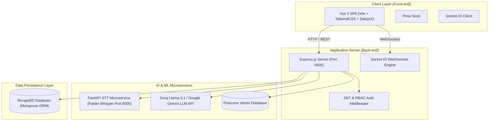

# 🚀 SmartMeet — AI-Powered Multi-Tenant Workspace Collaboration Platform

[](https://opensource.org/licenses/ISC)
[](https://vuejs.org/)
[](https://nodejs.org/)
[](https://expressjs.com/)
[](https://www.mongodb.com/)
[](https://www.python.org/)
[](https://fastapi.tiangolo.com/)
[](https://www.pinecone.io/)

SmartMeet is an enterprise-grade, multi-tenant workspace collaboration platform featuring real-time meeting transcription, automated AI summarization, retrieval-augmented intelligence (RAG Chat), task management, and community workspace isolation.

---

## 📸 Overview & Value Proposition

SmartMeet addresses the fragmentation of modern workplace tools by combining **video/audio meeting collaboration**, **AI speech-to-text transcription**, **action item extraction**, and **vector-based knowledge search** into a single multi-tenant workspace.

### Key Highlights
- **🏢 Absolute Multi-Tenancy & Data Isolation**: Every community (workspace) operates in complete data isolation. Data from one community is mathematically and logically inaccessible to another.
- **🎙️ Real-Time Speech-to-Text Microservice**: Powered by a dedicated Python FastAPI service running `faster_whisper` for ultra-fast, local CPU/GPU speech transcription.
- **🧠 Knowledge AI (RAG System)**: Query past meeting transcripts, summaries, and team decisions using vector embeddings (Pinecone + Groq Llama-3.1 / Google Gemini).
- **⚡ Real-Time Collaboration**: Instant messaging, live meeting transcripts, status updates, and notifications driven by Socket.IO.
- **🛡️ Enterprise Security**: Role-Based Access Control (RBAC), JWT authentication with refresh token sessions, Google OAuth 2.0, and TOTP Two-Factor Authentication (2FA).

---

## 🏗️ System Architecture



---

## ✨ Features at a Glance

### 1. Multi-Tenant Workspace & Community Management
- **Unique Invitation Codes**: Each community generates an 8-character unique alphanumeric join code.
- **Join Request Approvals**: Users entering a code enter a `pending` state; Community Owners (Admins) review and approve/reject candidates.
- **Member Management**: Role toggles, member removal, and invitation links.

### 2. Live Meetings & Audio Transcription
- **Real-Time Streaming**: Stream live audio chunks to the STT microservice.
- **Faster-Whisper Microservice**: High-accuracy local speech-to-text with auto language detection.
- **Live Speaker & Transcript Viewers**: Real-time text output synchronized across workspace participants via WebSockets.

### 3. AI Meeting Intelligence & RAG
- **Automated Summaries**: Multi-level summary generation (Executive Summary, Key Decisions, Action Items, Sentiment Analysis).
- **Vector Search & Q&A**: Ask natural language questions like *"What was decided about the Q3 budget in last Tuesday's meeting?"*.
- **Post-Meeting Automation**: Automatic creation of actionable tasks assigned to team members upon meeting closure, along with email recaps.

### 4. Task Management (Kanban & List Views)
- **Status Workflows**: `Todo` ➔ `In Progress` ➔ `Completed`.
- **Prioritization & Deadlines**: Low, Medium, High priority tagging with due date trackers and file attachment support.
- **Direct Assignment**: Assign tasks to workspace members with instant notification delivery.

### 5. Community Chat & Real-Time Notifications
- **Channel & Direct Chat**: Instant messaging powered by WebSockets.
- **Notification Engine**: In-app indicator and email notifications (via Nodemailer & Resend) for task assignments, meeting invites, and join approvals.

### 6. Security, Auth & Session Control
- **Dual Authentication**: Password-based bcrypt (12 rounds) or Google OAuth 2.0.
- **Multi-Factor Auth (2FA)**: Speakeasy TOTP verification with QR code generation.
- **Session Revocation**: View active sessions (browser, OS, device, IP) with remote logout capability.

---

## 🛠️ Technology Stack

| Domain | Technology / Library | Description |
| :--- | :--- | :--- |
| **Frontend Framework** | Vue 3 (Composition API) | Progressive JavaScript Framework |
| **State Management** | Pinia | Modular state management store |
| **Frontend Build & Styling** | Vite, Tailwind CSS, DaisyUI | Modern bundler & utility-first CSS |
| **Backend Runtime** | Node.js (ES Modules) | Asynchronous JavaScript runtime |
| **Web Framework** | Express 5.x | RESTful API backend server |
| **Primary Database** | MongoDB & Mongoose 9.x | NoSQL document persistence |
| **Speech-to-Text** | Python 3.10+, FastAPI, `faster_whisper` | Microservice for local audio transcription |
| **AI Summarization & RAG** | Groq (Llama-3.1), Google Gemini API | Large Language Model processing |
| **Vector Indexing** | Pinecone / ChromaDB | Embeddings vector store for RAG |
| **Real-time Engine** | Socket.IO | Bi-directional WebSocket communication |
| **Email Service** | Nodemailer, Resend | Transactional email dispatch |

---

## 📁 Repository Structure

```
SmartMeet/
├── Back-end/                  # Node.js Express REST API & WebSockets
│   ├── src/
│   │   ├── config/            # Database & external service configurations
│   │   ├── controllers/       # API business logic handlers (Users, Tasks, Meetings, RAG, etc.)
│   │   ├── middleware/        # JWT Authentication, RBAC, & Error handling
│   │   ├── models/            # Mongoose schemas (15 database collections)
│   │   ├── routes/            # Express route declarations
│   │   ├── services/          # RAG, STT, AI Analysis, Email, Vector Store services
│   │   ├── socket/            # Socket.IO event handlers
│   │   ├── utils/             # Token generation, helpers, password resetting
│   │   ├── app.js             # Express application setup
│   │   └── server.js          # HTTP server & WebSocket bootstrapping
│   ├── .env                   # Backend environment configuration
│   └── package.json
│
├── Front-end/                 # Vue 3 Single Page Application
│   ├── src/
│   │   ├── assets/            # Global images & CSS styles
│   │   ├── components/        # Reusable UI components (Modals, Avatars, Cards)
│   │   ├── composables/       # Composition API hooks
│   │   ├── router/            # Vue Router navigation definitions & guards
│   │   ├── services/          # Axios API service clients
│   │   ├── stores/            # Pinia global state modules (Auth, Tasks, Meetings, Chat)
│   │   └── views/             # Page views (Auth, Dashboard, LiveMeeting, KnowledgeAI, etc.)
│   ├── .env                   # Frontend environment configuration
│   └── package.json
│
├── stt-server/                # FastAPI Python Speech-to-Text Microservice
│   └── main.py                # Faster-Whisper audio transcription endpoint
│
├── ARCHITECTURE.md            # Architecture specification & rules
├── DOCUMENTATION.md           # Full technical documentation manual
└── README.md                  # Project overview (this file)
```

---

## ⚡ Quick Start & Installation

### Prerequisites
Make sure you have the following installed on your local setup:
- **Node.js**: `v18.x` or higher
- **npm**: `v9.x` or higher
- **MongoDB**: Local MongoDB instance running on port `27017` or a MongoDB Atlas URI
- **Python**: `v3.10` or higher (for `stt-server`)

---

### Step 1: Clone the Repository
```bash
git clone https://github.com/marwann022/SmartMeet.git
cd SmartMeet
```

---

### Step 2: Configure Environment Variables

#### 1. Backend (`Back-end/.env`)
Create a `.env` file in the `Back-end/` directory:
```env
PORT=5000
MONGO_URI=mongodb://127.0.0.1:27017/smartmeet
JWT_SECRET=your_jwt_secret_key_here
JWT_EXPIRE=30d

# Email Notifications (Nodemailer / Resend)
EMAIL_USER=your_email@gmail.com
EMAIL_PASS=your_app_password
RESEND_API_KEY=re_your_resend_api_key

# Google OAuth
GOOGLE_CLIENT_ID=your_google_client_id.apps.googleusercontent.com

# AI & RAG Configuration
GROQ_API_KEY=gsk_your_groq_api_key
GROQ_MODEL=llama-3.1-8b-instant
PINECONE_API_KEY=pcsk_your_pinecone_api_key
PINECONE_INDEX=smartmeet

FRONTEND_URL=http://localhost:5173
```

#### 2. Frontend (`Front-end/.env`)
Create a `.env` file in the `Front-end/` directory:
```env
VITE_GOOGLE_CLIENT_ID=your_google_client_id.apps.googleusercontent.com
```

---

### Step 3: Run the Backend Services

#### Start Node.js API Server
```bash
cd Back-end
npm install
npm run dev
```
*The Express server will start on [http://localhost:5000](http://localhost:5000)*.

---

### Step 4: Run the Speech-to-Text Microservice

```bash
cd stt-server
python3 -m venv venv
source venv/bin/activate  # On Windows: venv\Scripts\activate
pip install fastapi uvicorn faster-whisper python-multipart
uvicorn main:app --host 0.0.0.0 --port 8000 --reload
```
*The STT service will listen on [http://localhost:8000](http://localhost:8000)*.

---

### Step 5: Run the Frontend SPA

```bash
cd Front-end
npm install
npm run dev
```
*Open your browser and navigate to [http://localhost:5173](http://localhost:5173)*.

---

## 📡 API Reference Overview

Here are key API routes provided by the backend:

| Method | Endpoint | Description | Auth Required |
| :--- | :--- | :--- | :--- |
| `POST` | `/api/users/register` | Register a new User or Admin | ❌ No |
| `POST` | `/api/users/login` | Authenticate & obtain JWT token | ❌ No |
| `POST` | `/api/users/google-login` | Authenticate with Google ID Token | ❌ No |
| `GET` | `/api/communities/members` | Get all members of the active community | 🔒 Yes |
| `POST` | `/api/join-requests` | Submit request to join a community | 🔒 Yes |
| `PATCH` | `/api/join-requests/:id/approve` | Approve join request (Admin only) | 🔒 Admin |
| `GET` | `/api/tasks` | Fetch tasks scoped to workspace | 🔒 Yes |
| `POST` | `/api/tasks` | Create a new workspace task | 🔒 Yes |
| `GET` | `/api/meetings` | List scheduled & past workspace meetings | 🔒 Yes |
| `POST` | `/api/meetings` | Schedule a new meeting | 🔒 Yes |
| `POST` | `/api/rag/query` | RAG query over past meeting knowledge base | 🔒 Yes |
| `GET` | `/api/notifications` | Get user notifications | 🔒 Yes |

> 📖 **Full API & Schema Specification**: See [DOCUMENTATION.md](file:///Users/marwan/Documents/SmartMeet/DOCUMENTATION.md) for complete details.

---

## 🤝 Contributing

Contributions are welcome! Please follow these guidelines:
1. **Fork the Repository**
2. **Create a Feature Branch** (`git checkout -b feature/AmazingFeature`)
3. **Commit your Changes** (`git commit -m 'Add some AmazingFeature'`)
4. **Push to the Branch** (`git push origin feature/AmazingFeature`)
5. **Open a Pull Request**

---

## 📄 License

Distributed under the **ISC License**. See `LICENSE` for more information.

---

<p center="true">
  Made with ❤️ by Marwan & SmartMeet Team
</p>
