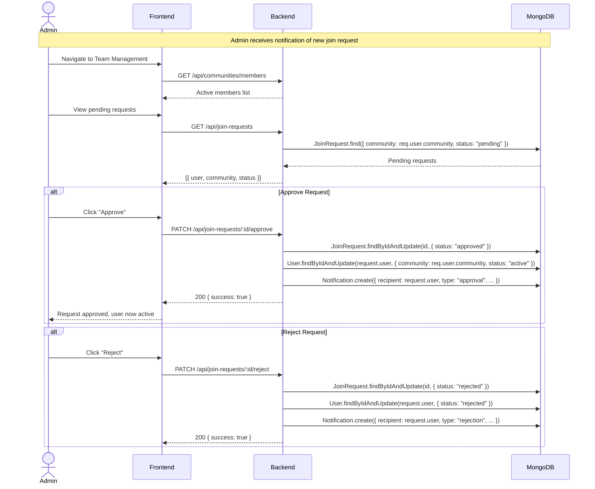
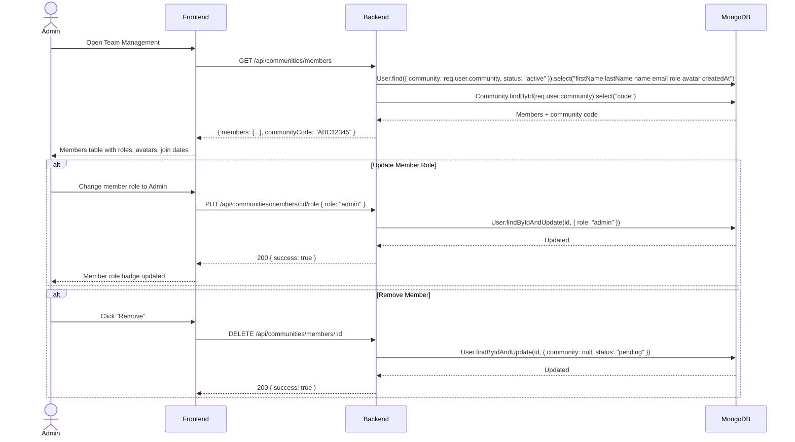
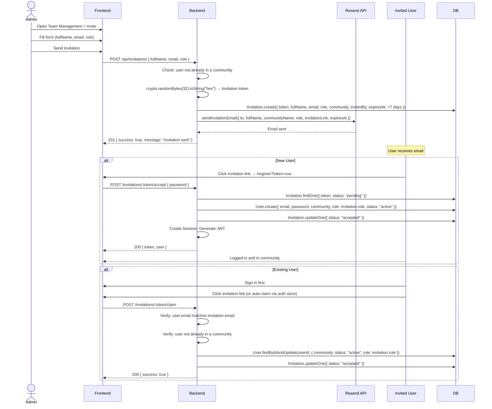
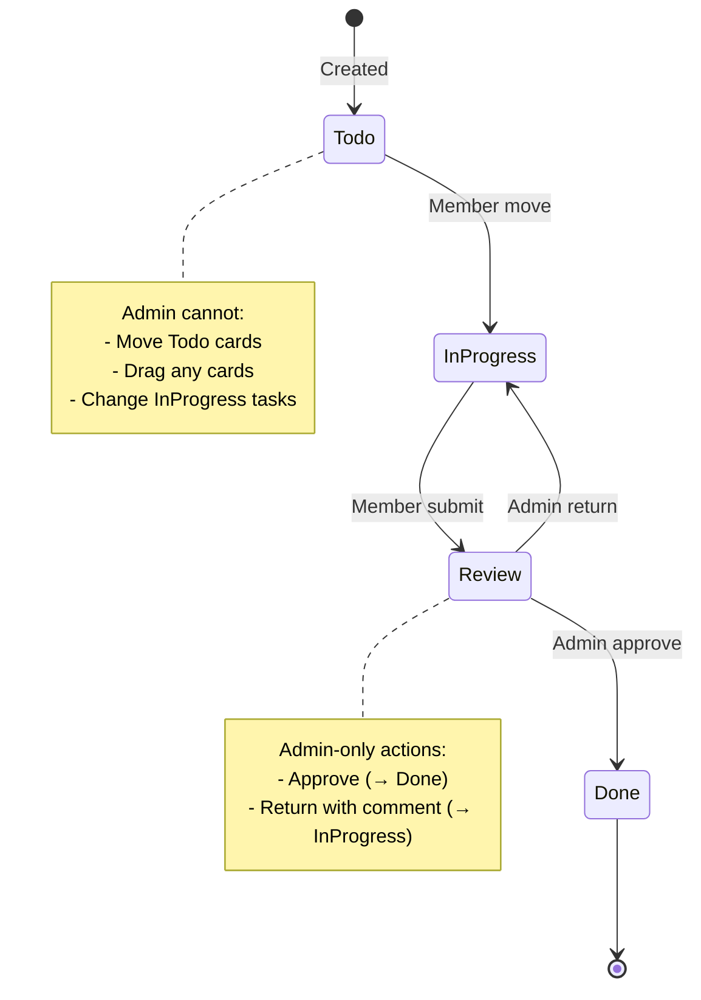
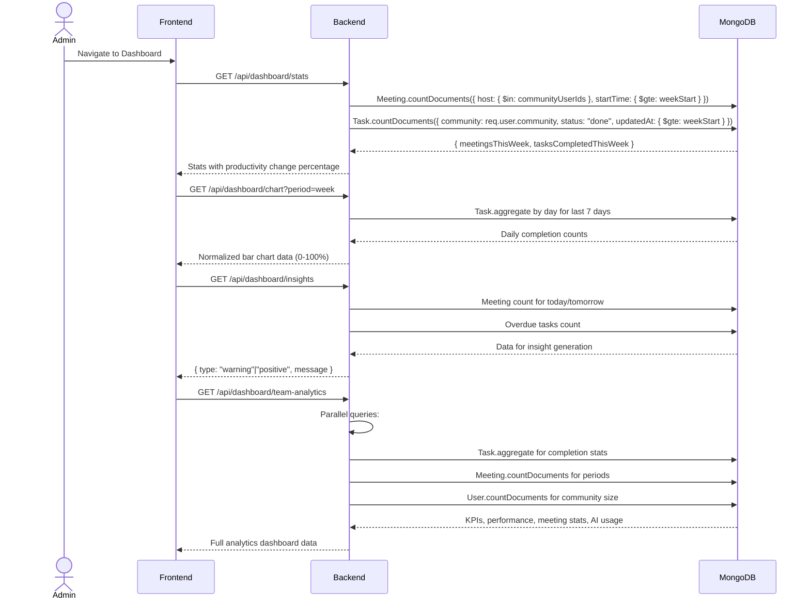

# SmartMeet — Admin Flow Documentation

## Admin Capabilities Matrix

| Capability | Endpoint | Auth | Description |
|---|---|---|---|
| Community Creation | `POST /api/users/register` | None | Admin registration auto-creates community |
| Join Request Management | `GET/PATCH /api/join-requests` | protect + adminOnly | List, approve, reject join requests |
| Member Management | `GET/PUT/DELETE /api/communities/members/:id` | protect + adminOnly | View, change role, remove members |
| Invitation Management | `POST /api/invitations` | protect + adminOnly | Email invitations to join workspace |
| Task Review | `PUT /api/tasks/:id/approve` | protect | Approve review-stage tasks |
| Task Review | `PUT /api/tasks/:id/reject` | protect | Return tasks to in-progress |
| Task Management | `POST/PUT/DELETE /api/tasks` | protect | Create, edit, delete any community task |
| Meeting Management | `PUT /api/meetings/:id` | protect | Update meetings (host or community admin) |
| Notifications | Various | protect | Receive all notification types |
| Team Analytics | `GET /api/dashboard/team-analytics` | protect | View team-wide metrics |
| Dashboard | `GET /api/dashboard/*` | protect | Stats, charts, insights |
| Community Overview | `GET /api/communities/overview` | protect + adminOnly | Full community data |

## Admin Registration Flow

```mermaid
sequenceDiagram
    actor A as Admin
    participant FE as Frontend
    participant BE as Backend
    participant DB as MongoDB

    A->>FE: Visit /signup
    A->>FE: Select "Admin" role
    A->>FE: Fill form (name, email, password)
    A->>FE: Submit
    FE->>BE: POST /api/users/register { name, email, password, role: "admin" }
    
    BE->>BE: Validate password strength
    BE->>BE: Generate 8-char unique community code (uppercase alphanumeric)
    BE->>DB: User.create({ name, email, password, role: "admin", status: "active" })
    DB-->>BE: New admin user
    
    BE->>DB: Community.create({ name: `${firstName}'s Community`, code, owner: user._id })
    DB-->>BE: New community
    
    BE->>DB: user.community = community._id; user.save()
    BE->>BE: Create Session with device fingerprinting
    BE->>BE: Generate JWT
    
    BE-->>FE: 201 { success: true, token, sessionId, user, communityCode }
    FE->>FE: Store token + user in localStorage
    FE->>FE: Redirect to /dashboard
    A-->>FE: Full admin dashboard with community code visible
```

**Database Changes:**
- New User document (`role: "admin"`, `status: "active"`, `community` set)
- New Community document (`owner` set to admin's ID)
- New Session document

---

## Join Request Management



**Security Checks:**
- `adminOnly` middleware verifies `req.user.role === "admin"`
- Join requests scoped to admin's community via `req.user.community`
- Only pending requests can be approved/rejected

**Notifications:**
- Approved user receives `approval` notification
- Rejected user receives `rejection` notification

---

## Member Management



---

## Email Invitation Flow



---

## Task Review Workflow (Admin)



**Admin's View on Each Status:**

| Status | Card Appearance | Actions Available | Drag Allowed |
|---|---|---|---|
| To Do | Locked (no drag, no buttons) | View details in modal (informational only) | No |
| In Progress | Locked (no drag, no buttons) | View details in modal (informational only) | No |
| Review | Approve / Return buttons visible | Approve, Return with comment | No |
| Done | Locked (no drag, no buttons) | View details in modal (informational only) | No |

---

## Dashboard Analytics (Admin View)



## Security Enforcement for Admin

All admin operations enforce the following security layers:

1. **JWT Authentication** (`protect` middleware): Verifies the user is authenticated
2. **Role Verification** (`adminOnly` middleware): Verifies `req.user.role === "admin"`
3. **Data Isolation**: All queries filter by `req.user.community`
4. **Ownership Verification**: Community operations verify the admin owns the community via `community.owner`
5. **Input Validation**: Mongoose schema validation on all writes
6. **CORS**: API only accepts requests from configured frontend origin
