# SmartMeet — Authentication & Authorization

## Architecture Overview

SmartMeet uses a **hybrid authentication system** combining JWT (primary), Google OAuth 2.0 (optional), and TOTP-based two-factor authentication. Sessions are tracked independently for device management.

```mermaid
graph TD
    subgraph AuthFlow["Authentication Flow"]
        A[User] --> B{Login Method}
        B --> C[Email + Password]
        B --> D[Google OAuth]
        C --> E[Validate Credentials]
        D --> F[Verify Google ID Token]
        E --> G{2FA Enabled?}
        G -->|Yes| H[Return preAuthToken]
        G -->|No| I[Generate JWT]
        F --> I
        H --> J[Submit TOTP Code]
        J --> K[Verify & Generate JWT]
        I --> L[Create Session]
        K --> L
        L --> M[Return JWT + User Profile]
    end

    subgraph Middleware["Request Middleware"]
        N[Client Request] --> O[Authorization: Bearer <token>]
        O --> P[protect Middleware]
        P --> Q{Token Valid?}
        Q -->|No| R[401 Unauthorized]
        Q -->|Yes| S[Decode JWT → user._id]
        S --> T[Find User in DB]
        T --> U[Attach to req.user]
        U --> V[Route Handler]
    end
```

## JWT Token

### Generation

Tokens are generated in `Back-end/src/utils/generateToken.js`:

```javascript
import jwt from "jsonwebtoken";

const generateToken = (id, sessionId) => {
  return jwt.sign({ id, ...(sessionId && { sessionId }) }, process.env.JWT_SECRET, {
    expiresIn: process.env.JWT_EXPIRE || "7d",
  });
};
```

**Payload:**
```json
{
  "id": "user_object_id",
  "sessionId": "optional_session_id",
  "iat": 1719876543,
  "exp": 1720481343
}
```

### Verification

The `protect` middleware decodes the JWT, looks up the user, and attaches the full user document to `req.user`:

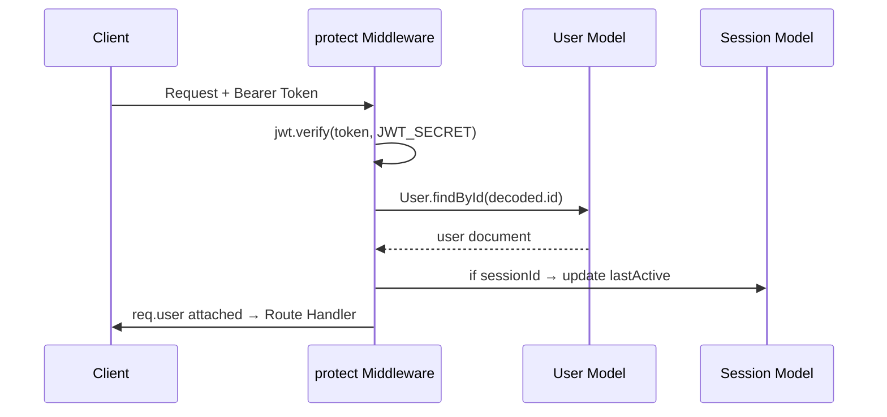

## Registration Flow

### Admin Registration

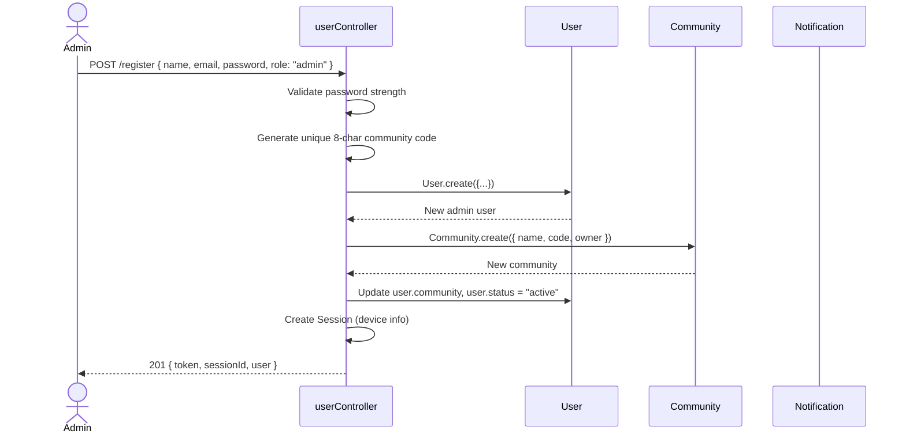

### User Registration

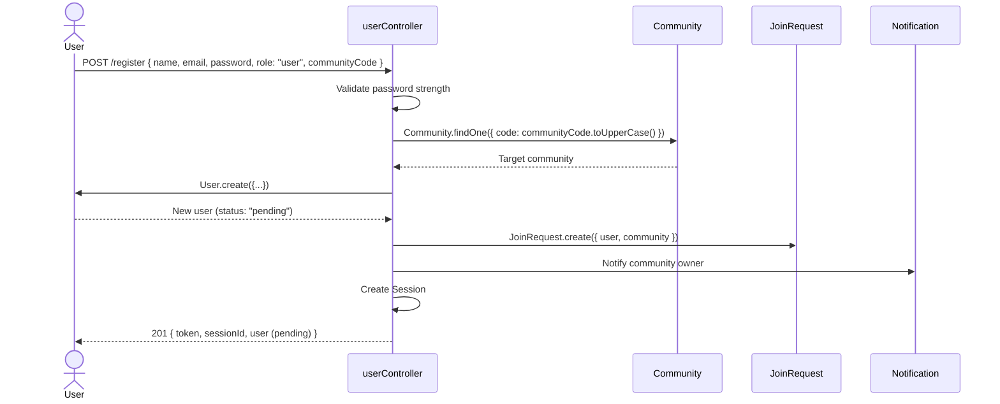

## Login Flow

### Email/Password Login

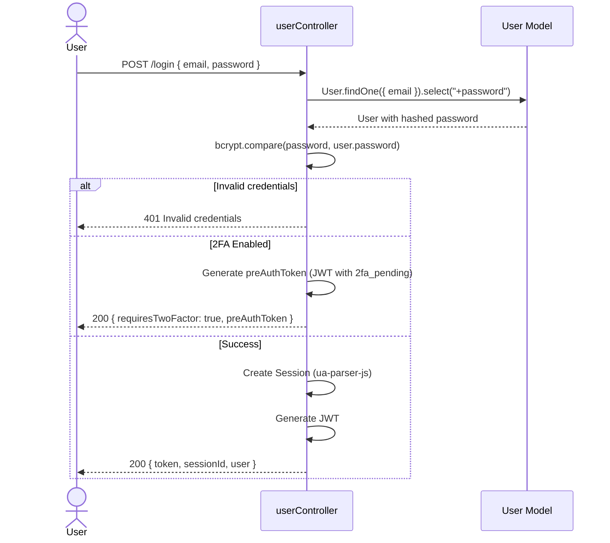

### Google OAuth Login

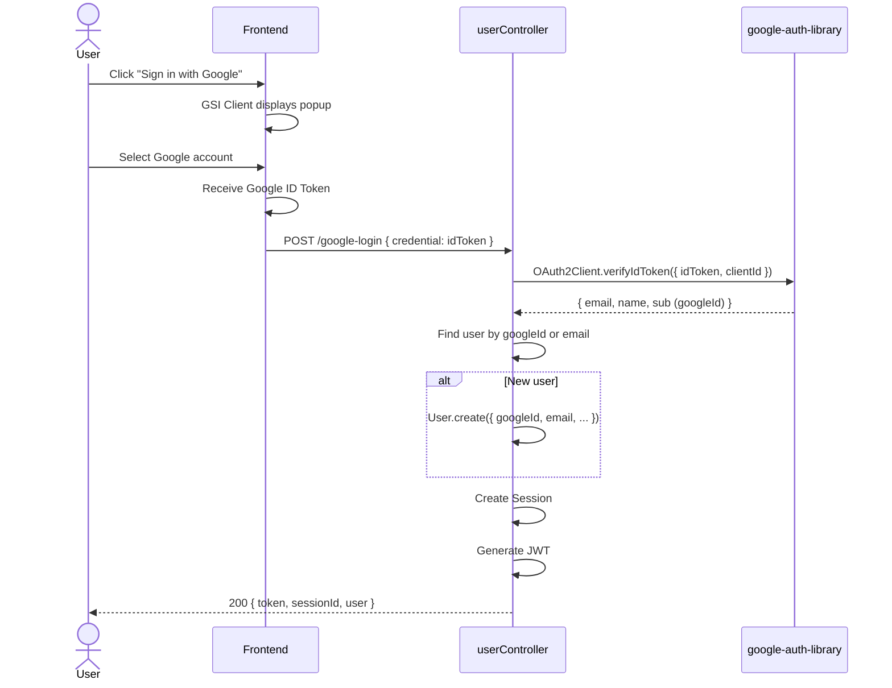

## Two-Factor Authentication (2FA)

### Setup Flow

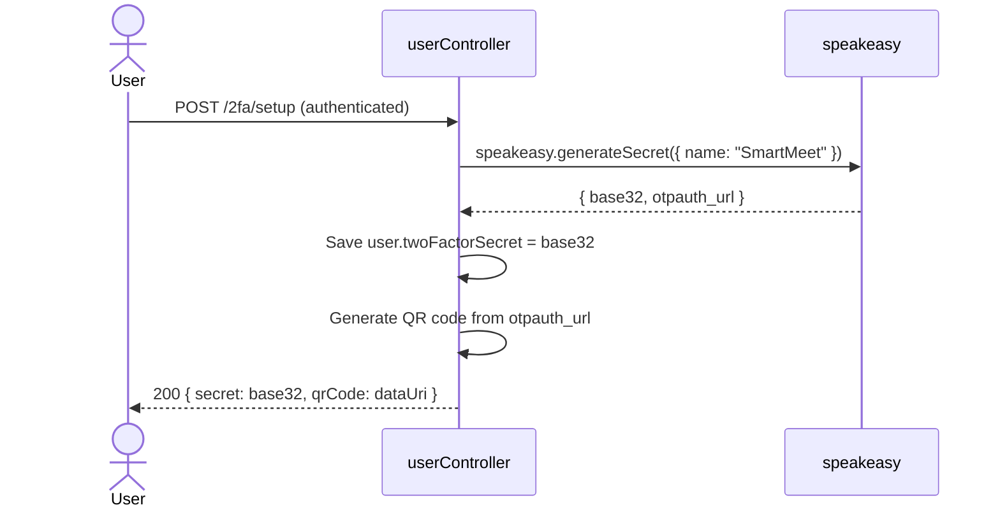

### Verification Flow

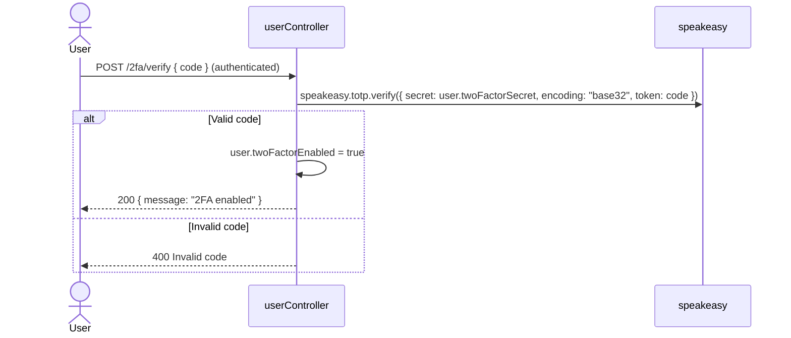

### Login with 2FA

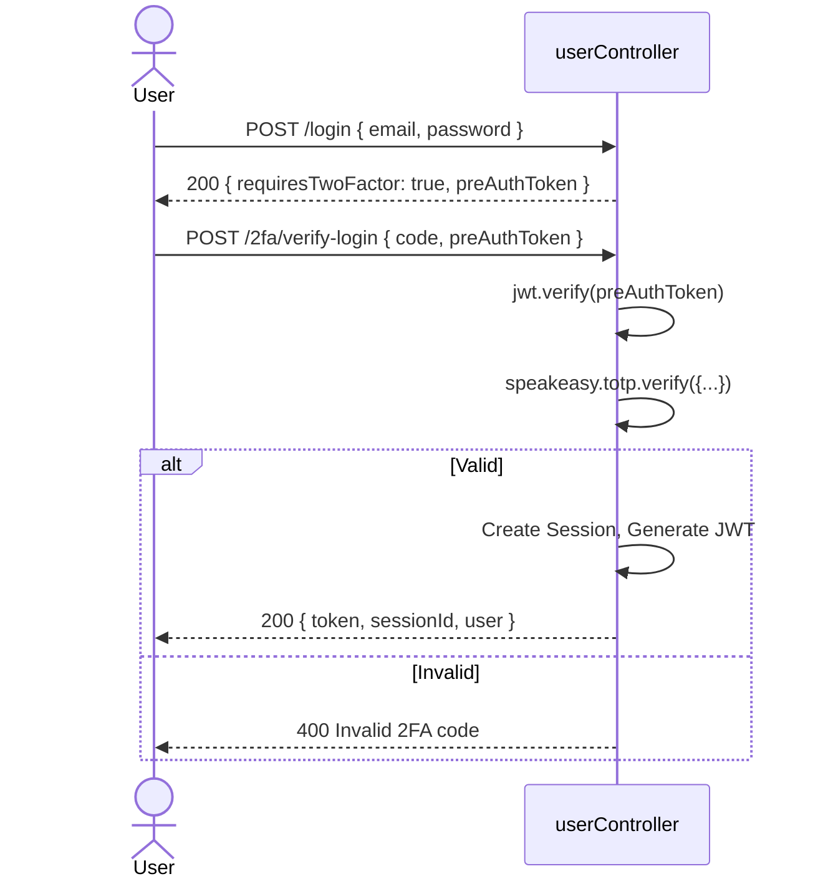

## Password Reset

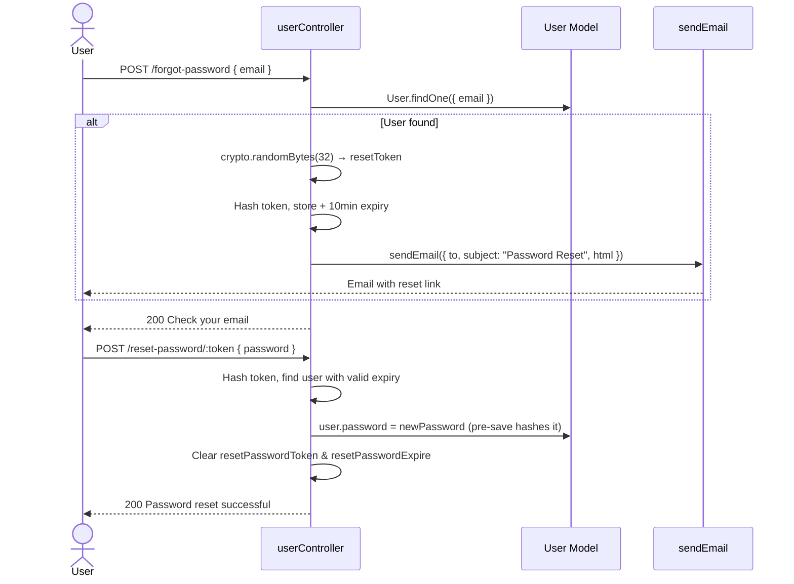

## Role-Based Access Control

### Middleware Chain

```javascript
router.get("/admin-only-route", protect, adminOnly, handler);
router.get("/multi-role", protect, authorizeRoles("admin", "manager"), handler);
```

### Protect Middleware (`authMiddleware.js`)

```
1. Extract token from Authorization header (Bearer <token>)
2. If no token → 401 { message: "Not authorized, no token" }
3. jwt.verify(token, JWT_SECRET)
4. If invalid → 401 { message: "Not authorized, token failed" }
5. User.findById(decoded.id)
6. If no user → 401 { message: "Not authorized, user not found" }
7. req.user = user
8. If decoded.sessionId → Session.findByIdAndUpdate(sessionId, { lastActive: now })
9. next()
```

### AdminOnly Middleware

```javascript
export const adminOnly = (req, res, next) => {
  if (req.user && req.user.role === "admin") {
    next();
  } else {
    return res.status(403).json({ message: "Admin access required" });
  }
};
```

### Permission Matrix

| Endpoint Group | Auth Required | Admin Required | Notes |
|---|---|---|---|
| Register, Login, Google Login | No | No | Public endpoints |
| Forgot/Reset Password | No | No | Token-based access |
| User Profile (GET/PUT) | Yes | No | Own profile only |
| Change Password | Yes | No | Own password only |
| 2FA Setup/Verify/Disable | Yes | No | Own 2FA only |
| Sessions (List/Revoke) | Yes | No | Own sessions only |
| Notification Settings | Yes | No | Own settings only |
| Meetings (CRUD) | Yes | Varies | Host or community admin |
| Tasks (CRUD) | Yes | Varies | Admin sees all; member sees own |
| RAG Query | Yes | No | Authenticated users only |
| Join Requests (List) | Yes | Yes | |
| Join Requests (Approve/Reject) | Yes | Yes | |
| Community (Members/Stats) | Yes | Yes | |
| Community (Update Role/Remove) | Yes | Yes | |
| Invitation (Create) | Yes | Yes | |
| Dashboard (Stats/Chart/Insights) | Yes | No | Authenticated users only |
| Team Analytics | Yes | No | Scoped to user's visibility |
| Subscription (Get) | Yes | No | Own subscription only |

## Session Management

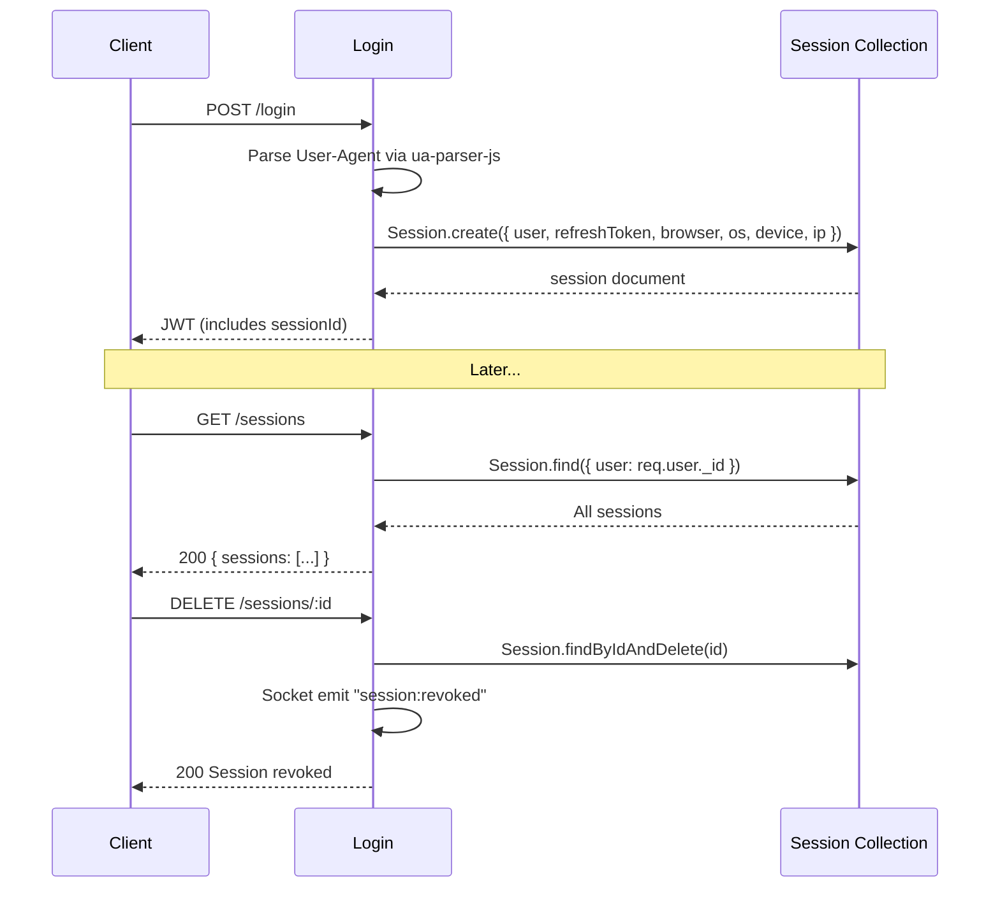

## Security Best Practices Enforced

| Practice | Implementation |
|---|---|
| Password hashing | bcrypt, 12 salt rounds, pre-save hook |
| Password strength | Min 8 chars, must include lowercase, uppercase, number, special character |
| JWT secret | Environment variable, not hardcoded |
| Token expiry | Configurable via `JWT_EXPIRE` (default 7 days) |
| No raw user objects | `getPublicProfile()` strips password, refreshToken, 2FA secret |
| Email case normalization | All emails stored lowercase |
| Community code uppercase | Always stored and compared uppercase |
| Data isolation | Every query scoped to `req.user.community` |
| Ownership validation | Tasks, meetings, sessions verified before modification |
| MongoDB injection prevention | Mongoose sanitizes queries |
| CORS | Configured for frontend origin only |
| File upload validation | Multer handles multipart; no size limit (should be hardened) |
| User status gating | Pending/rejected users restricted to dashboard and settings |
| Socket authentication | JWT verified on every connection |
| Rate limiting | Not yet implemented (recommended addition) |

## Auth-Related Environment Variables

| Variable | Purpose |
|---|---|
| `JWT_SECRET` | Secret key for JWT signing |
| `JWT_EXPIRE` | Token expiration duration (default: `7d`) |
| `GOOGLE_CLIENT_ID` | Google OAuth client ID for GSI verification |
| `FRONTEND_URL` | Frontend URL for CORS (default: `http://localhost:5173`) |
