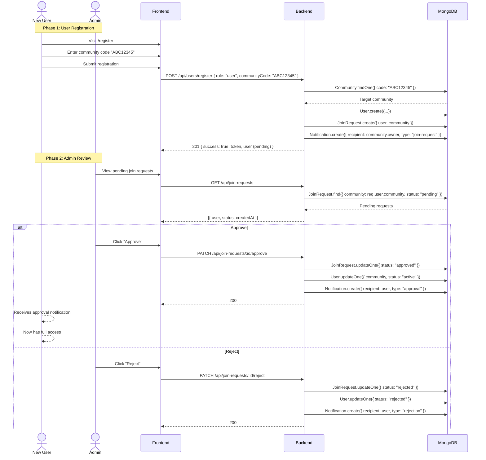
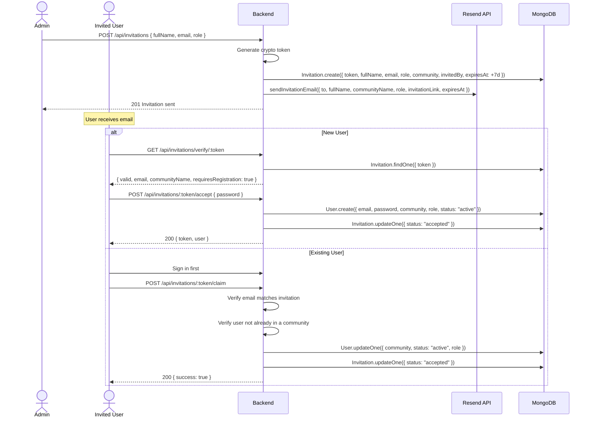

# SmartMeet — Community & Multi-Tenancy

## Overview

SmartMeet uses a **multi-tenant workspace** model called Communities. Each community is a fully isolated workspace with its own members, meetings, tasks, chat, and notifications. Absolute data isolation is enforced at every database query level — no user can ever access data from another community.

## Core Concepts

```mermaid
graph TB
    subgraph CommunityA["Community: Acme Corp"]
        A1[Admin: Alice]
        A2[Member: Bob]
        A3[Member: Charlie]
        A4[Meetings]
        A5[Tasks]
        A6[Chat Messages]
    end

    subgraph CommunityB["Community: Beta Inc"]
        B1[Admin: Dave]
        B2[Member: Eve]
        B3[Meetings]
        B4[Tasks]
        B5[Chat Messages]
    end

    A1 --> A4
    A1 --> A5
    A2 --> A4
    A2 --> A5
    A3 --> A5
    B1 --> B3
    B1 --> B4
    B2 --> B3
    B2 --> B4

    Note: No cross-community data access
```

## Key Rules

| Rule | Description |
|---|---|
| One admin per community | Each community has exactly one owner (admin) |
| One community per user | A user belongs to at most one community |
| Unique invitation code | Each community has an 8-character uppercase alphanumeric code |
| Approval required | Users must be approved by the admin before joining |
| Absolute isolation | Every query filters by `community: req.user.community` |

## Community Lifecycle

```mermaid
stateDiagram-v2
    [*] --> Created: Admin Registration
    
    Created --> Active: Admin manages
    Active --> Growing: Members join
    
    state Growing {
        [*] --> JoinRequest: User submits code
        JoinRequest --> Pending: Request created
        Pending --> Approved: Admin approves
        Pending --> Rejected: Admin rejects
        Approved --> [*]: User becomes active member
    end
    
    Active --> [*]: (No deletion UI exists)
```

## Community Model

**File:** `Back-end/src/models/Community.js`

```javascript
{
  name: String,           // Required — workspace display name
  code: String,           // Unique, uppercase — 8-char invitation code
  owner: ObjectId,        // FK → User — community administrator
  description: String,    // Optional workspace description
  createdAt: Date,        // Auto
  updatedAt: Date,        // Auto
}
```

## Join Request Workflow



## Invitation System

The invitation system provides an alternative onboarding path: admins can send email invitations with a secure token. Invited users bypass the join-request flow and are directly assigned to the community.



## Community API Endpoints

| Method | Endpoint | Auth | Description |
|---|---|---|---|
| GET | `/api/communities/members` | protect + adminOnly | List all active members + community code |
| GET | `/api/communities/stats` | protect + adminOnly | Total members, active tasks, pending invitations |
| GET | `/api/communities/overview` | protect | Full community overview (role-dependent data) |
| PUT | `/api/communities/members/:id/role` | protect + adminOnly | Change member role (user ↔ admin) |
| DELETE | `/api/communities/members/:id` | protect + adminOnly | Remove member from community |

## Join Request API Endpoints

| Method | Endpoint | Auth | Description |
|---|---|---|---|
| POST | `/api/join-requests` | protect | Submit join request with community code |
| GET | `/api/join-requests` | protect + adminOnly | List pending requests |
| PATCH | `/api/join-requests/:id/approve` | protect + adminOnly | Approve request |
| PATCH | `/api/join-requests/:id/reject` | protect + adminOnly | Reject request |

## Invitation API Endpoints

| Method | Endpoint | Auth | Description |
|---|---|---|---|
| POST | `/api/invitations` | protect + adminOnly | Create invitation |
| GET | `/api/invitations/verify/:token` | None | Verify invitation token |
| POST | `/api/invitations/:token/accept` | None | Accept invitation (new user) |
| POST | `/api/invitations/:token/claim` | protect | Claim invitation (existing user) |

## Data Isolation Pattern

Every database query in community-scoped features follows this pattern:

```javascript
// Correct — data isolated
Model.find({ community: req.user.community, ...otherFilters });

// WRONG — data leak
Model.find({ ...otherFilters });  // No community filter!
```

## Community Chat

The community chat system provides real-time messaging for all active community members. See [CommunityChat.md](./CommunityChat.md) for details.
