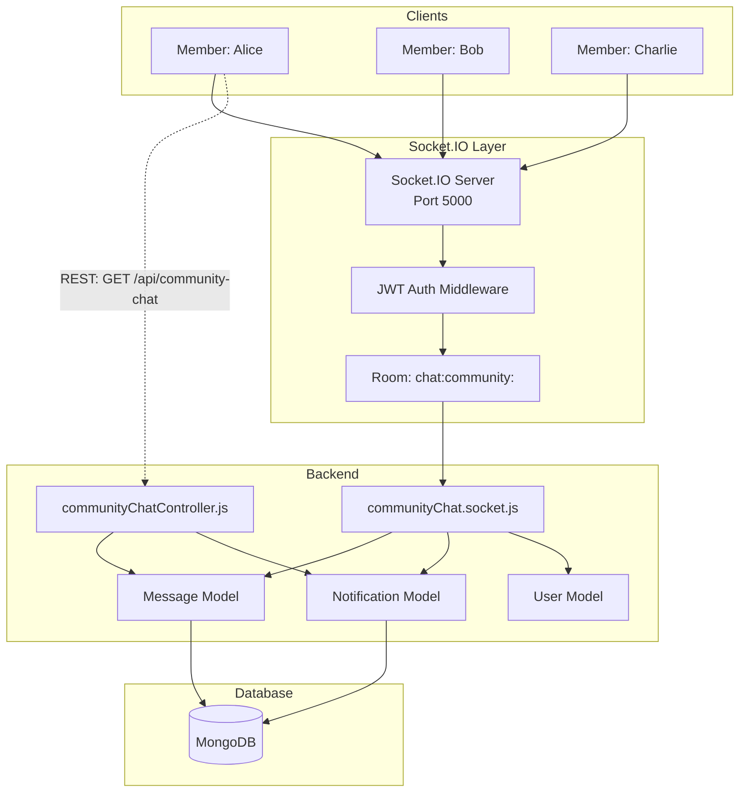
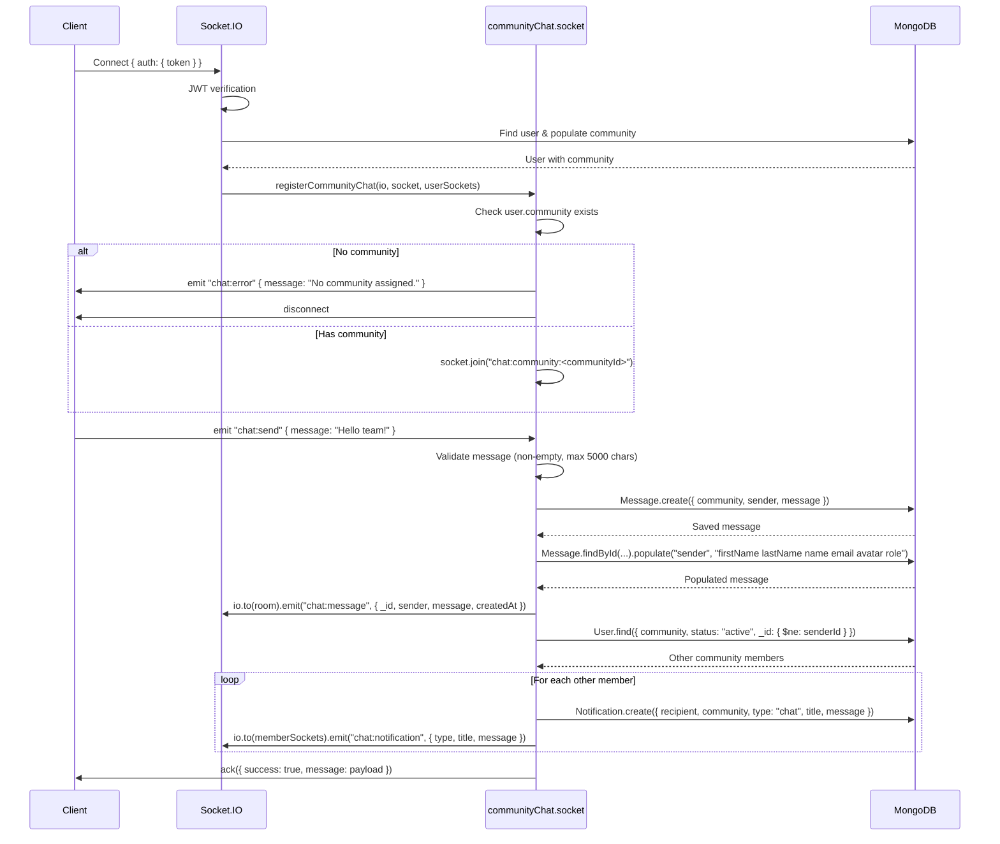

# SmartMeet — Community Chat

## Feature Overview

Community Chat is a **real-time group messaging system** for community members. Built on Socket.IO, messages are delivered instantly to all online members, persisted in MongoDB, and backed up by REST API endpoints for paginated history retrieval.

## Architecture



## Socket Events

### Client → Server

| Event | Payload | Description |
|---|---|---|
| `chat:send` | `{ message: string }` | Send a new chat message |

### Server → Client

| Event | Payload | Description |
|---|---|---|
| `chat:message` | `{ _id, sender, message, createdAt }` | New message broadcast to room |
| `chat:notification` | `{ type, title, message }` | Chat notification to individual sockets |
| `chat:error` | `{ error: string }` | Error message to sender |

## Connection Flow



## REST API Endpoints

| Method | Endpoint | Auth | Description |
|---|---|---|---|
| GET | `/api/community-chat` | protect | Get paginated messages (default 50, max 100) |
| POST | `/api/community-chat` | protect | Create a message |
| DELETE | `/api/community-chat/:id` | protect | Delete a message (owner or admin) |

### GET /api/community-chat

**Query Parameters:**
- `page` (number, default: 1)
- `limit` (number, default: 50, max: 100)

**Response:**
```json
{
  "success": true,
  "messages": [
    {
      "_id": "...",
      "sender": { "_id": "...", "firstName": "John", "lastName": "Doe", "avatar": "..." },
      "message": "Hello team!",
      "createdAt": "2024-01-01T12:00:00.000Z"
    }
  ],
  "pagination": {
    "page": 1,
    "limit": 50,
    "total": 120,
    "pages": 3
  }
}
```

## Message Model

**File:** `Back-end/src/models/Message.js`

```javascript
{
  community: ObjectId,   // FK → Community (required, indexed)
  sender: ObjectId,      // FK → User (required)
  message: String,       // Required, max 5000 characters
  createdAt: Date,       // Auto
  updatedAt: Date,       // Auto
}
```

**Indexes:**
- `{ community: 1, createdAt: -1 }` — for paginated community message queries

## Notification Integration

When a chat message is sent, all other active community members receive:
1. An in-app `Notification` document (`type: "chat"`)
2. A real-time socket event `chat:notification` (if online)

Notification title format: `"New message from {senderName}"`
Notification message: First 100 characters of the message (truncated with `…`)

## Error Handling

| Scenario | Behavior |
|---|---|
| Empty message | `ack({ success: false, error: "Message cannot be empty." })` |
| Message > 5000 chars | `ack({ success: false, error: "Message too long." })` |
| User has no community | Socket emits `chat:error` and disconnects |
| Database write failure | `ack({ success: false, error: "Failed to send message." })` |
| Socket.IO connection lost | Client-side auto-reconnection (built into Socket.IO client) |

## Performance Considerations

- Messages are stored individually (not batched)
- The REST endpoint returns messages newest-first but reverses them client-side for chronological display
- Socket.IO rooms provide efficient message broadcasting — each community has its own room
- Notifications are sent sequentially (not parallel) — could be optimized with `Promise.all` for large communities
- The sender population on socket events adds a query per message (could cache sender info in socket)
