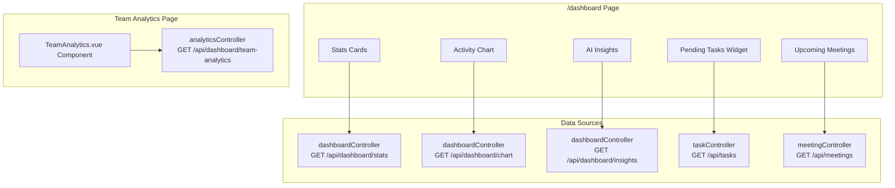

# SmartMeet — Dashboard & Analytics

## Feature Overview

The Dashboard module provides a consolidated view of workspace activity, task productivity, AI-powered insights, and comprehensive team analytics. It is the landing page after authentication and the primary entry point for all workspace operations.

## Dashboard Components



## API Endpoints

| Method | Endpoint | Auth | Description |
|---|---|---|---|
| GET | `/api/dashboard/stats` | protect | Weekly stats (meetings, tasks, productivity) |
| GET | `/api/dashboard/chart` | protect | Activity chart data (daily completions) |
| GET | `/api/dashboard/insights` | protect | AI-generated insights (burnout risk, overdue) |
| GET | `/api/dashboard/team-analytics` | protect | Full team analytics |

## Dashboard Stats

**File:** `Back-end/src/controllers/dashboardController.js` — `getDashboardStats`

```javascript
const getDashboardStats = async (req, res) => {
  const weekStart = new Date();
  weekStart.setDate(weekStart.getDate() - weekStart.getDay());
  weekStart.setHours(0, 0, 0, 0);

  const communityId = req.user.community;

  // Meetings this week
  const meetingsThisWeek = await Meeting.countDocuments({
    host: communityUserIds,  // community users
    startTime: { $gte: weekStart },
  });

  // Tasks completed this week
  const tasksCompletedThisWeek = await Task.countDocuments({
    community: communityId,
    status: "done",
    updatedAt: { $gte: weekStart },
  });

  // Tasks completed last week (for productivity comparison)
  const lastWeekStart = new Date(weekStart);
  lastWeekStart.setDate(lastWeekStart.getDate() - 7);
  const tasksCompletedLastWeek = await Task.countDocuments({
    community: communityId,
    status: "done",
    updatedAt: { $gte: lastWeekStart, $lt: weekStart },
  });

  const productivityChange = tasksCompletedLastWeek > 0
    ? ((tasksCompletedThisWeek - tasksCompletedLastWeek) / tasksCompletedLastWeek) * 100
    : tasksCompletedThisWeek > 0 ? 100 : 0;

  res.json({ meetingsThisWeek, tasksCompletedThisWeek, productivityChange });
};
```

**Response:**
```json
{
  "meetingsThisWeek": 3,
  "tasksCompletedThisWeek": 12,
  "productivityChange": 20
}
```

## Activity Chart

**File:** `Back-end/src/controllers/dashboardController.js` — `getActivityChart`

```javascript
const getActivityChart = async (req, res) => {
  const period = req.query.period || "week"; // "week" or "month"
  const days = period === "month" ? 30 : 7;
  
  // Daily task completions via aggregation
  const data = await Task.aggregate([
    { $match: { community: communityId, status: "done" } },
    // Group by day, count completions
    // ...
  ]);

  // Normalize to 0-100% bar values
  // ...
};
```

**Response:**
```json
{
  "labels": ["Mon", "Tue", "Wed", "Thu", "Fri", "Sat", "Sun"],
  "values": [65, 59, 80, 81, 56, 55, 40],
  "maxValue": 81
}
```

## AI Insights

**File:** `Back-end/src/controllers/dashboardController.js` — `getInsights`

Three types of insights:

| Type | Condition | Message |
|---|---|---|
| `warning` | 3+ meetings scheduled for today/tomorrow | "Heavy meeting load detected tomorrow" |
| `warning` | Overdue tasks found | "You have overdue tasks" |
| `positive` | Default (no warnings) | "Great progress this week!" |

## Team Analytics

**File:** `Back-end/src/controllers/analyticsController.js` — `getTeamAnalytics`

Comprehensive endpoint that returns:

### KPIs
```json
{
  "completionRate": 78.5,
  "performanceScore": 82.3,
  "overdueTasks": 3,
  "tasksCompleted": 45,
  "totalTasks": 57
}
```

### Team Performance
```json
{
  "topContributors": [
    { "name": "Alice", "completed": 15, "completionRate": 88 }
  ]
}
```

### Meeting Statistics
```json
{
  "meetingsThisWeek": 5,
  "meetingsThisMonth": 18,
  "averageDuration": 42,
  "attendance": 85
}
```

### AI Usage
```json
{
  "summariesGenerated": 12,
  "hoursSaved": 8.5
}
```

### Community Activity
- Meeting counts by status
- Task counts by status
- Active member count

## Frontend Pinia Store

**File:** `Front-end/src/stores/dashboard.js`

```javascript
state: {
  stats: { meetingsThisWeek: 0, tasksCompletedThisWeek: 0, productivityChange: 0 },
  chartData: [],
  chartPeriod: "week",
  insights: [],
  teamAnalytics: null,
  loading: { stats: false, chart: false, insights: false, teamAnalytics: false },
  errors: { stats: null, chart: null, insights: null, teamAnalytics: null },
}

actions: {
  fetchStats(),         // GET /api/dashboard/stats
  fetchChartData(period), // GET /api/dashboard/chart?period=<period>
  fetchInsights(),      // GET /api/dashboard/insights
  fetchTeamAnalytics(), // GET /api/dashboard/team-analytics
}
```

## Component Tree

```
Dashboard.vue
├── DashboardMain.vue
│   ├── Stats Cards (meetingsThisWeek, tasksCompletedThisWeek, productivityChange)
│   ├── Activity Chart (bar chart from chartData)
│   ├── AI Insights card
│   ├── Pending Tasks widget (filtered, top 5)
│   │   └── TaskCard.vue (simplified)
│   └── Upcoming Meetings widget
│       └── MeetingCard.vue
├── DashboardTasks.vue
│   └── Kanban Board
│       ├── Column: To Do
│       ├── Column: In Progress
│       ├── Column: Review
│       └── Column: Done
├── TeamAnalytics.vue
│   ├── KPIs section
│   ├── Performance section
│   └── AI Usage section
```

## User Status Gating

Users with `status: "pending"` or `status: "rejected"` can only access:
- `/dashboard` (limited view)
- `/settings` (profile settings)

All other authenticated routes redirect to `/dashboard` for pending/rejected users.
