# SmartMeet — Database Documentation

## Entity-Relationship Diagram (ERD)

```mermaid
erDiagram
    Community ||--o{ User : "has members"
    Community ||--o{ JoinRequest : "receives requests"
    Community ||--o{ Task : "scopes tasks"
    Community ||--o{ Meeting : "scopes meetings"
    Community ||--o{ Notification : "scopes notifications"
    Community ||--o{ Message : "scopes chat"
    Community ||--o{ Invitation : "scopes invitations"
    
    User ||--o{ Session : "has sessions"
    User ||--o{ Notification : "receives notifications"
    User ||--o{ JoinRequest : "submits requests"
    User ||--o{ Meeting : "hosts meetings"
    User ||--o{ Task : "assigned tasks"
    User ||--o{ Message : "sends messages"
    User ||--o{ ChatSession : "owns RAG sessions"
    
    Meeting ||--o{ MeetingTranscript : "has transcript"
    Meeting ||--o{ MeetingKnowledge : "has analysis"
    Meeting ||--o{ MeetingEmbedding : "has vectors"
    Meeting ||--o{ ActionItem : "has action items"
    
    ChatSession ||--o{ ChatMessage : "contains messages"

    Community {
        ObjectId _id PK
        String name "Required"
        String code "Unique, uppercase"
        ObjectId owner "FK -> User"
        String description
        Date createdAt
        Date updatedAt
    }

    User {
        ObjectId _id PK
        String name "Full name"
        String firstName
        String lastName
        String email "Unique, lowercase"
        String password "Hashed, select: false"
        String role "enum: user | admin"
        ObjectId community "FK -> Community, nullable"
        String status "enum: pending | active | rejected"
        String phone
        String company
        String jobTitle
        String avatar
        Boolean twoFactorEnabled
        String twoFactorSecret
        String googleId
        Boolean isActive
        Date lastLogin
        String refreshToken
        String resetPasswordToken
        String resetPasswordExpire
        Object notificationSettings
        Object subscription
        Date createdAt
        Date updatedAt
    }

    Session {
        ObjectId _id PK
        ObjectId user "FK -> User, required"
        String refreshToken "required"
        String browser
        String browserVersion
        String os
        String osVersion
        String device
        String deviceType "Default: desktop"
        String ip
        Date lastActive
        Date createdAt
        Date updatedAt
    }

    JoinRequest {
        ObjectId _id PK
        ObjectId user "FK -> User, required"
        ObjectId community "FK -> Community, required"
        String status "enum: pending | approved | rejected"
        Date createdAt
        Date updatedAt
    }

    Meeting {
        ObjectId _id PK
        String title "Required"
        String description
        ObjectId host "FK -> User, indexed"
        Array participants "{ name, email, role }[]"
        Date startTime
        Date endTime
        Number duration "Minutes"
        String type "enum: Personal | Personal Discussion | Team | Client | Standup | Brainstorm | Other"
        String status "enum: scheduled | live | completed | cancelled"
        String recordingPath
        String meetingLink
        String meetingId "Unique, sparse"
        Date createdAt
        Date updatedAt
    }

    Task {
        ObjectId _id PK
        ObjectId user "FK -> User, required"
        String title
        String description
        String priority
        String status "enum: todo | inprogress | review | done"
        Boolean done
        String previousStatus
        String assignee
        String avatarColor
        String due
        Date dueDate
        String dueTime
        String source
        ObjectId community "FK -> Community"
        ObjectId createdBy "FK -> User"
        ObjectId meeting "FK -> Meeting"
        Boolean isPersonal
        Boolean needsAdminDeadlineResolution
        String reviewComment
        Array reviewHistory "{ action, user, comment, timestamp }[]"
        Date createdAt
        Date updatedAt
    }

    MeetingTranscript {
        ObjectId _id PK
        ObjectId meeting "FK -> Meeting, unique, required"
        String transcript "Full text, required"
        String language "Default: auto"
        String sourceAudioPath
        Number durationSeconds
        Array chunks "{ index, text, startChar, endChar, tokenEstimate, vectorId, embeddingStored }[]"
        Date createdAt
        Date updatedAt
    }

    MeetingKnowledge {
        ObjectId _id PK
        ObjectId meeting "FK -> Meeting, unique, required"
        String summary "Required"
        String meetingOverview
        Array topics "String[]"
        Array participants "String[]"
        Array decisions "{ text, owner, deadline, confidence }[]"
        Array deadlines "{ text, owner, deadline, confidence }[]"
        Array risks "{ text, owner, deadline, confidence }[]"
        Array openQuestions "{ text, owner, deadline, confidence }[]"
        Array agreements "{ text, owner, deadline, confidence }[]"
        Array disagreements "{ text, owner, deadline, confidence }[]"
        Array followUpTasks "{ text, owner, deadline, confidence }[]"
        Array actionItems "{ text, owner, deadline, confidence }[]"
        String analysisModel "Default: llama-3.3-70b-versatile"
        Date createdAt
        Date updatedAt
    }

    MeetingEmbedding {
        ObjectId _id PK
        ObjectId meeting "FK -> Meeting, indexed"
        String vectorId "Unique, required"
        Number chunkIndex "Required"
        String text "Required"
        Array embedding "Number[], select: false"
        Map metadata "Map of Mixed"
        Date createdAt
        Date updatedAt
    }

    ActionItem {
        ObjectId _id PK
        ObjectId meeting "FK -> Meeting, required, indexed"
        String title "Required, max 220"
        String description
        String assignedTo "Indexed"
        Date deadline "Indexed"
        String status "enum: open | in_progress | blocked | done, indexed"
        String priority "enum: low | medium | high"
        String sourceText
        Boolean needsAdminDeadlineResolution
        Date createdAt
        Date updatedAt
    }

    Notification {
        ObjectId _id PK
        ObjectId recipient "FK -> User, required"
        ObjectId community "FK -> Community, nullable"
        String type "enum: join-request | task | meeting | document | approval | rejection | chat"
        String title "Required"
        String message "Required"
        ObjectId relatedId "Polymorphic reference"
        String status "enum: pending | approved | rejected"
        Boolean read "Default: false"
        Date createdAt
        Date updatedAt
    }

    Message {
        ObjectId _id PK
        ObjectId community "FK -> Community, required, indexed"
        ObjectId sender "FK -> User, required"
        String message "Required, max 5000"
        Date createdAt
        Date updatedAt
    }

    Invitation {
        ObjectId _id PK
        String token "Unique, required"
        String fullName "Required"
        String email "Lowercase, required"
        String role "enum: user | admin, required"
        ObjectId community "FK -> Community, required"
        ObjectId invitedBy "FK -> User, required"
        String status "enum: pending | accepted | expired"
        Date expiresAt "Required"
        Date createdAt
        Date updatedAt
    }

    ChatSession {
        ObjectId _id PK
        ObjectId user "FK -> User, required, indexed"
        String title "Default: New Chat"
        Date createdAt
        Date updatedAt
    }

    ChatMessage {
        ObjectId _id PK
        ObjectId session "FK -> ChatSession, required, indexed"
        String role "enum: user | assistant, required"
        String text "Required"
        Array sources "{ meetingId, title, snippet, score }[]"
        Date createdAt
    }
```



## Collection Details

### Communities

| Field | Type | Description | Constraints |
|---|---|---|---|
| `_id` | ObjectId | Primary key | Auto-generated |
| `name` | String | Workspace display name | Required |
| `code` | String | 8-character uppercase invitation code | Unique, uppercase, required |
| `owner` | ObjectId | Community owner (FK → User) | Required, indexed |
| `description` | String | Optional workspace description | Default: "" |
| `createdAt` | Date | Auto-generated timestamp | Timestamps: true |
| `updatedAt` | Date | Auto-generated timestamp | Timestamps: true |

**Indexes:**
- `{ code: 1 }` — unique (enforced by schema `unique: true`)
- `{ owner: 1 }` — explicit index for owner lookups

**Lifecycle:**
- Created during admin registration (Phase 3)
- Name defaults to `"${firstName}'s Community"`
- Destroyed only by direct database operation (no UI for deletion)

### Users

| Field | Type | Description | Constraints |
|---|---|---|---|
| `_id` | ObjectId | Primary key | Auto-generated |
| `name` | String | Full display name | Required |
| `firstName` | String | First name | Required |
| `lastName` | String | Last name | Optional |
| `email` | String | Email address | Unique, lowercase, required |
| `password` | String | bcrypt-hashed password | `select: false`, required |
| `role` | String | Access level | Enum: `user` (default) \| `admin` |
| `community` | ObjectId | Community membership (FK → Community) | Nullable, default: null |
| `status` | String | Account status | Enum: `pending` (default) \| `active` \| `rejected` |
| `phone` | String | Phone number | Optional |
| `company` | String | Company name | Optional |
| `jobTitle` | String | Job title | Optional |
| `avatar` | String | Avatar URL | Optional |
| `twoFactorEnabled` | Boolean | 2FA status | Default: false |
| `twoFactorSecret` | String | TOTP secret | Optional |
| `googleId` | String | Google OAuth ID | Optional, unique |
| `isActive` | Boolean | Soft delete flag | Default: true |
| `lastLogin` | Date | Last login timestamp | Optional |
| `refreshToken` | String | Current refresh token | Optional |
| `resetPasswordToken` | String | Password reset token | Optional |
| `resetPasswordExpire` | Date | Reset token expiry | Optional |
| `notificationSettings` | Object | User notification preferences | See below |
| `subscription` | Object | Subscription details | See below |
| `createdAt` | Date | Auto-generated | Timestamps: true |
| `updatedAt` | Date | Auto-generated | Timestamps: true |

**notificationSettings sub-document:**
```json
{
  "summaries": Boolean,
  "reports": Boolean,
  "digestTime": String,
  "reminderWindow": String,
  "quietHours": Object,
  "pushDesktop": Boolean,
  "pushMobile": Boolean
}
```

**subscription sub-document:**
```json
{
  "plan": String,
  "price": Number,
  "currency": String,
  "billingCycle": String,
  "renewalDate": Date,
  "stripeCustomerId": String,
  "status": String
}
```

**Indexes:**
- `{ email: 1 }` — unique (enforced by schema)
- `{ createdAt: -1 }` — for sorting by registration date
- `{ googleId: 1 }` — sparse unique (for Google OAuth lookups)

**Lifecycle:**
1. User registers → document created with `status: "pending"` (user) or `"active"` (admin)
2. Admin approves join request → `status` updated to `"active"`, `community` set
3. Admin rejects join request → `status` set to `"rejected"`
4. Admin can remove member → `community` set to null, `status` set to `"pending"`

### Sessions

| Field | Type | Description | Constraints |
|---|---|---|---|
| `_id` | ObjectId | Primary key | Auto-generated |
| `user` | ObjectId | Session owner (FK → User) | Required |
| `refreshToken` | String | JWT refresh token | Required |
| `browser` | String | Detected browser name | Parsed via ua-parser-js |
| `browserVersion` | String | Browser version | Parsed via ua-parser-js |
| `os` | String | Operating system | Parsed via ua-parser-js |
| `osVersion` | String | OS version | Parsed via ua-parser-js |
| `device` | String | Device name | Parsed via ua-parser-js |
| `deviceType` | String | Device type | Default: "desktop" |
| `ip` | String | Client IP address | Optional |
| `lastActive` | Date | Last activity timestamp | Default: now |
| `createdAt` | Date | Login timestamp | Timestamps: true |
| `updatedAt` | Date | Last update | Timestamps: true |

**Indexes:** (None explicitly declared beyond `_id`)

**Lifecycle:**
- Created on every login (email/password and Google)
- `lastActive` updated on API calls if `sessionId` present in JWT
- Listed via `GET /api/users/sessions`
- Deleted via `DELETE /api/users/sessions/:id` (session revocation)
- Cleaned up on logout (frontend clears token)

### JoinRequests

| Field | Type | Description | Constraints |
|---|---|---|---|
| `_id` | ObjectId | Primary key | Auto-generated |
| `user` | ObjectId | Requesting user (FK → User) | Required |
| `community` | ObjectId | Target community (FK → Community) | Required |
| `status` | String | Request status | Enum: `pending` (default) \| `approved` \| `rejected` |
| `createdAt` | Date | Submission timestamp | Timestamps: true |
| `updatedAt` | Date | Last update | Timestamps: true |

**Indexes:**
- `{ user: 1, community: 1 }` — unique compound (prevents duplicate requests)
- `{ community: 1 }` — for admin listing by community

**Lifecycle:**
1. User submits community code → JoinRequest created with `status: "pending"`
2. Admin views pending requests → `GET /api/join-requests`
3. Admin approves → `status: "approved"`, user's `community` and `status` updated
4. Admin rejects → `status: "rejected"`, user's `status` updated to `"rejected"`

### Meetings

| Field | Type | Description | Constraints |
|---|---|---|---|
| `_id` | ObjectId | Primary key | Auto-generated |
| `title` | String | Meeting title | Required |
| `description` | String | Meeting description | Optional |
| `host` | ObjectId | Meeting host (FK → User) | Required, indexed |
| `participants` | Array | Participant list | `[{ name, email, role }]` |
| `startTime` | Date | Scheduled start time | Optional |
| `endTime` | Date | Actual end time | Optional |
| `duration` | Number | Duration in minutes | Optional |
| `type` | String | Meeting type | Enum: Personal, Personal Discussion, Team, Client, Standup, Brainstorm, Other |
| `status` | String | Meeting status | Enum: `scheduled` (default) \| `live` \| `completed` \| `cancelled` |
| `recordingPath` | String | Path to uploaded recording | Optional |
| `meetingLink` | String | External meeting link (e.g., Jitsi URL) | Optional |
| `meetingId` | String | Unique meeting identifier | Unique, sparse |
| `createdAt` | Date | Auto-generated | Timestamps: true |
| `updatedAt` | Date | Auto-generated | Timestamps: true |

**Indexes:**
- `{ host: 1, status: 1, startTime: -1 }` — compound for meeting listing queries
- `{ meetingId: 1 }` — unique, sparse

**Lifecycle:**
1. Created via `POST /api/meetings` → status: `"scheduled"`
2. Recording uploaded via `POST /api/meetings/:id/upload-recording`
3. Processing triggered via `POST /api/meetings/:id/process` → status: `"live"`
4. AI pipeline runs → status: `"completed"`
5. Accessed via `GET /api/meetings` (complex permission scoping)

### Tasks

| Field | Type | Description | Constraints |
|---|---|---|---|
| `_id` | ObjectId | Primary key | Auto-generated |
| `user` | ObjectId | Task owner/assignee (FK → User) | Required |
| `title` | String | Task title | Optional |
| `description` | String | Task description | Optional |
| `priority` | String | Priority level | String |
| `status` | String | Task status | Enum: `todo` (default) \| `inprogress` \| `review` \| `done` |
| `done` | Boolean | Completion flag | Optional |
| `previousStatus` | String | Previous status for rollback | Optional |
| `assignee` | String | Assignee display name | Optional |
| `avatarColor` | String | Avatar color for UI | Optional |
| `due` | String | Due date (string format) | Optional |
| `dueDate` | Date | Due date (Date format) | Optional |
| `dueTime` | String | Due time | Optional |
| `source` | String | Source description (e.g., "Meeting: Q3 Sync") | Optional |
| `community` | ObjectId | Community scope (FK → Community) | Optional |
| `createdBy` | ObjectId | Creator (FK → User) | Optional |
| `meeting` | ObjectId | Source meeting (FK → Meeting) | Optional |
| `isPersonal` | Boolean | Personal task flag | Optional |
| `needsAdminDeadlineResolution` | Boolean | Deadline needs admin attention | Optional |
| `reviewComment` | String | Admin review comment | Optional |
| `reviewHistory` | Array | Audit trail | `[{ action, user, comment, timestamp }]` |
| `createdAt` | Date | Auto-generated | Timestamps: true |
| `updatedAt` | Date | Auto-generated | Timestamps: true |

**Indexes:** (None explicitly declared beyond `_id`)

**Lifecycle:**
1. Created manually by user or automatically from meeting action items
2. Member moves: todo → inprogress → review
3. Admin approves: review → done (or returns: review → inprogress)
4. Deleted by admin or creator

### MeetingTranscript

| Field | Type | Description | Constraints |
|---|---|---|---|
| `_id` | ObjectId | Primary key | Auto-generated |
| `meeting` | ObjectId | Source meeting (FK → Meeting) | Unique, required, indexed |
| `transcript` | String | Full transcript text | Required |
| `language` | String | Detected language | Default: "auto" |
| `sourceAudioPath` | String | Path to source audio file | Optional |
| `durationSeconds` | Number | Audio duration | Optional |
| `chunks` | Array | Chunk metadata | `[{ index, text, startChar, endChar, tokenEstimate, vectorId, embeddingStored }]` |
| `createdAt` | Date | Auto-generated | Timestamps: true |
| `updatedAt` | Date | Auto-generated | Timestamps: true |

**Indexes:**
- Text index on `transcript` for full-text search
- Unique on `meeting` (one transcript per meeting)

### MeetingKnowledge

| Field | Type | Description | Constraints |
|---|---|---|---|
| `_id` | ObjectId | Primary key | Auto-generated |
| `meeting` | ObjectId | Source meeting (FK → Meeting) | Unique, required, indexed |
| `summary` | String | Executive summary | Required |
| `meetingOverview` | String | Detailed overview | Optional |
| `topics` | Array | Discussion topics | `String[]`, indexed |
| `participants` | Array | Participant names | `String[]` |
| `decisions` | Array | Meeting decisions | `[{ text, owner, deadline, confidence }]` |
| `deadlines` | Array | Discussed deadlines | `[{ text, owner, deadline, confidence }]` |
| `risks` | Array | Identified risks | `[{ text, owner, deadline, confidence }]` |
| `openQuestions` | Array | Unresolved questions | `[{ text, owner, deadline, confidence }]` |
| `agreements` | Array | Points of agreement | `[{ text, owner, deadline, confidence }]` |
| `disagreements` | Array | Points of disagreement | `[{ text, owner, deadline, confidence }]` |
| `followUpTasks` | Array | Follow-up items | `[{ text, owner, deadline, confidence }]` |
| `actionItems` | Array | Action items | `[{ text, owner, deadline, confidence }]` |
| `analysisModel` | String | LLM used for analysis | Default: "llama-3.3-70b-versatile" |
| `createdAt` | Date | Auto-generated | Timestamps: true |
| `updatedAt` | Date | Auto-generated | Timestamps: true |

**Indexes:**
- Text index on `summary`, `meetingOverview`, `topics`
- Index on `updatedAt`
- Unique on `meeting`

### MeetingEmbedding

| Field | Type | Description | Constraints |
|---|---|---|---|
| `_id` | ObjectId | Primary key | Auto-generated |
| `meeting` | ObjectId | Source meeting (FK → Meeting) | Indexed |
| `vectorId` | String | Unique vector identifier | Required, unique |
| `chunkIndex` | Number | Chunk sequence index | Required |
| `text` | String | Chunk text content | Required |
| `embedding` | Array | 384-dimension vector | `Number[]`, `select: false` |
| `metadata` | Map | Metadata key-value pairs | Map of Mixed |
| `createdAt` | Date | Auto-generated | Timestamps: true |
| `updatedAt` | Date | Auto-generated | Timestamps: true |

**Indexes:**
- `{ meeting: 1, chunkIndex: 1 }` — unique compound
- `{ vectorId: 1 }` — unique
- Text index on `text`

### ActionItem

| Field | Type | Description | Constraints |
|---|---|---|---|
| `_id` | ObjectId | Primary key | Auto-generated |
| `meeting` | ObjectId | Source meeting (FK → Meeting) | Required, indexed |
| `title` | String | Action item title | Required, max 220 chars |
| `description` | String | Detailed description | Optional |
| `assignedTo` | String | Assignee name | Indexed |
| `deadline` | Date | Due date | Indexed |
| `status` | String | Current status | Enum: `open` (default) \| `in_progress` \| `blocked` \| `done`, indexed |
| `priority` | String | Priority | Enum: `low` \| `medium` \| `high` |
| `sourceText` | String | Original transcript source | Optional |
| `needsAdminDeadlineResolution` | Boolean | Flag for admin attention | Optional |
| `createdAt` | Date | Auto-generated | Timestamps: true |
| `updatedAt` | Date | Auto-generated | Timestamps: true |

**Indexes:**
- `{ meeting: 1, assignedTo: 1, status: 1 }` — compound
- Text index on `title`, `description`, `assignedTo`

**Pre-save Hook:**
- Validates `deadline` is not a placeholder string (tbd, n/a, none, unknown)

### Notifications

| Field | Type | Description | Constraints |
|---|---|---|---|
| `_id` | ObjectId | Primary key | Auto-generated |
| `recipient` | ObjectId | Notification receiver (FK → User) | Required |
| `community` | ObjectId | Related community (FK → Community) | Nullable, default: null |
| `type` | String | Notification category | Enum: `join-request` \| `task` \| `meeting` \| `document` \| `approval` \| `rejection` \| `chat` |
| `title` | String | Notification title | Required |
| `message` | String | Notification body | Required |
| `relatedId` | ObjectId | Related entity ID | Polymorphic (Task, Meeting, etc.) |
| `status` | String | For join-request notifications | Enum: `pending` \| `approved` \| `rejected` |
| `read` | Boolean | Read status | Default: false |
| `createdAt` | Date | Auto-generated | Timestamps: true |
| `updatedAt` | Date | Auto-generated | Timestamps: true |

**Indexes:**
- `{ recipient: 1, read: 1 }` — compound for unread notification queries
- `{ community: 1 }` — for community-scoped queries

### Messages (Community Chat)

| Field | Type | Description | Constraints |
|---|---|---|---|
| `_id` | ObjectId | Primary key | Auto-generated |
| `community` | ObjectId | Community scope (FK → Community) | Required, indexed |
| `sender` | ObjectId | Message sender (FK → User) | Required |
| `message` | String | Message content | Required, max 5000 chars |
| `createdAt` | Date | Auto-generated | Timestamps: true |
| `updatedAt` | Date | Auto-generated | Timestamps: true |

**Indexes:**
- `{ community: 1, createdAt: -1 }` — compound for paginated retrieval

### Invitations

| Field | Type | Description | Constraints |
|---|---|---|---|
| `_id` | ObjectId | Primary key | Auto-generated |
| `token` | String | Unique verification token | Required, unique |
| `fullName` | String | Invitee full name | Required |
| `email` | String | Invitee email | Lowercase, required |
| `role` | String | Assigned role | Enum: `user` \| `admin`, required |
| `community` | ObjectId | Target community (FK → Community) | Required |
| `invitedBy` | ObjectId | Inviting admin (FK → User) | Required |
| `status` | String | Invitation status | Enum: `pending` (default) \| `accepted` \| `expired` |
| `expiresAt` | Date | Expiration date | Required |
| `createdAt` | Date | Auto-generated | Timestamps: true |
| `updatedAt` | Date | Auto-generated | Timestamps: true |

**Indexes:**
- `{ community: 1 }` — for community-scoped lookups
- `{ email: 1, community: 1 }` — compound for deduplication

### ChatSession (RAG)

| Field | Type | Description | Constraints |
|---|---|---|---|
| `_id` | ObjectId | Primary key | Auto-generated |
| `user` | ObjectId | Session owner (FK → User) | Required, indexed |
| `title` | String | Session title | Default: "New Chat" |
| `createdAt` | Date | Auto-generated | Timestamps: true |
| `updatedAt` | Date | Auto-generated | Timestamps: true |

### ChatMessage (RAG)

| Field | Type | Description | Constraints |
|---|---|---|---|
| `_id` | ObjectId | Primary key | Auto-generated |
| `session` | ObjectId | Parent session (FK → ChatSession) | Required, indexed |
| `role` | String | Message role | Enum: `user` \| `assistant`, required |
| `text` | String | Message content | Required |
| `sources` | Array | Cited sources | `[{ meetingId, title, snippet, score }]` |
| `createdAt` | Date | Auto-generated | |

## Relationship Summary

```
Community (1) ────< (N) User        One community has many members
User (1) ──── (1) Community          One user belongs to at most one community
Community (1) ────< (N) JoinRequest  One community receives many join requests
User (1) ────< (N) JoinRequest       One user can submit requests (one per community)
Community (1) ────< (N) Task         Tasks scoped to community
Community (1) ────< (N) Meeting      Meetings scoped to community
Community (1) ────< (N) Message      Chat messages scoped to community
Community (1) ────< (N) Invitation   Invitations scoped to community
Meeting (1) ──── (1) MeetingTranscript  One transcript per meeting
Meeting (1) ──── (1) MeetingKnowledge   One knowledge document per meeting
Meeting (1) ────< (N) MeetingEmbedding  Many embedding vectors per meeting
Meeting (1) ────< (N) ActionItem        Many action items per meeting
ChatSession (1) ────< (N) ChatMessage   Many messages per session
User (1) ────< (N) Session           Many login sessions per user
User (1) ────< (N) Notification      Many notifications per user (as recipient)
User (1) ────< (N) ChatSession       Many RAG sessions per user
User (1) ────< (N) Message           Many chat messages per user (as sender)
```
