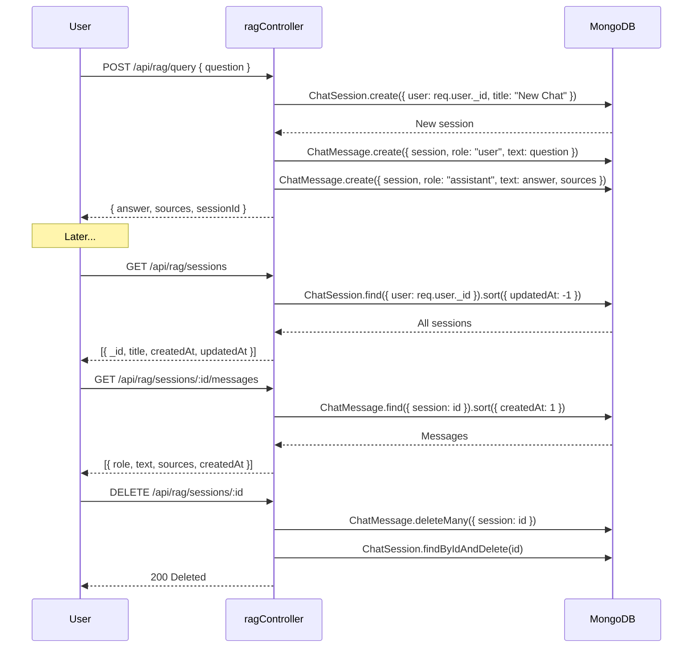
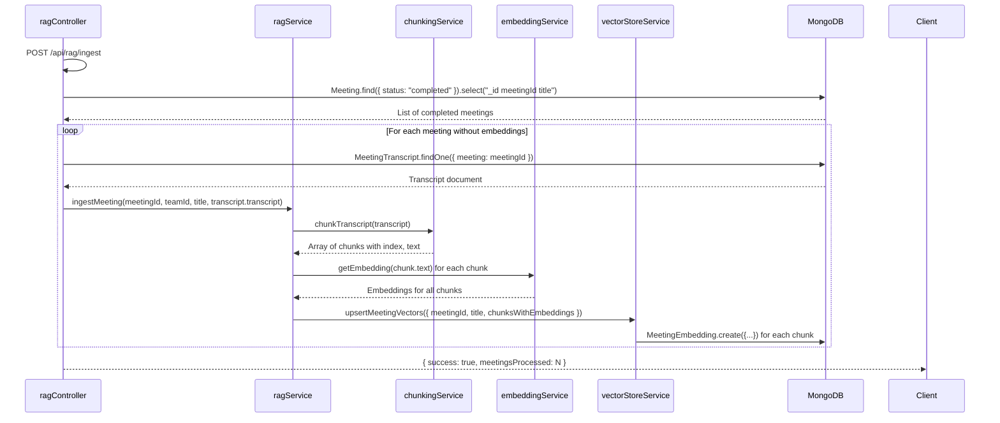

# SmartMeet — Knowledge AI (RAG Engine)

## Feature Overview

Knowledge AI is SmartMeet's **Retrieval-Augmented Generation (RAG)** engine that allows users to ask natural language questions about their past meetings. It combines semantic vector search with Large Language Model (LLM) generation to produce contextual answers with source citations.

Instead of having to manually review meeting transcripts, users simply ask questions like:
- "What decisions were made in the last meeting?"
- "Show me action items from the Q3 Product Roadmap Sync"
- "What were the risks discussed about the database migration?"

## Architecture

```mermaid
graph TD
    subgraph Input["User Input"]
        A[Natural Language Question]
    end

    subgraph QueryProcessing["Query Processing"]
        B[Relative Time Detection<br/>"last meeting", "previous sync"]
        C[Title Matching Boost<br/>"Q3 Product Roadmap Sync"]
        D[Embedding Generation<br/>Xenova all-MiniLM-L6-v2]
    end

    subgraph Retrieval["Semantic Retrieval"]
        E{Vector Store Provider}
        E -->|MongoDB| F[Cosine Similarity<br/>over 1000 candidates]
        E -->|Pinecone| G[Managed Vector Search]
        E -->|ChromaDB| H[Local Vector Search]
        I[Top-K Results<br/>(default: 5)]
    end

    subgraph ContextBuilding["Context Assembly"]
        J[System Prompt<br/>SmartMeet Identity]
        K[Passages from Matched Chunks]
        L[Meeting Title Scoping Hint]
    end

    subgraph Generation["Answer Generation"]
        M[Groq Llama 3.3<br/>70B parameters]
        N{Success?}
        O[Rate Limited → Fallback<br/>to Llama 3.1 8B]
        P[Formatted Answer<br/>+ Source Citations]
    end

    subgraph Storage["Persistence"]
        Q[ChatSession]
        R[ChatMessage<br/>User + Assistant]
    end

    A --> B
    A --> C
    A --> D
    B --> I
    C --> I
    D --> E
    F --> I
    G --> I
    H --> I
    I --> K
    J --> M
    K --> M
    L --> M
    M --> N
    N -->|yes| P
    N -->|no| O
    O --> P
    P --> Q
    P --> R
```

## Detailed Query Execution Flow

```mermaid
sequenceDiagram
    participant U as User
    participant RC as ragController
    participant RS as ragService
    participant ES as embeddingService
    participant VSS as vectorStoreService
    participant DB as MongoDB
    participant LLM as Groq API

    U->>RC: POST /api/rag/query { question, sessionId? }

    RC->>RC: Resolve or create ChatSession
    
    RC->>RS: isRelativeRecentQuery(question)
    alt Relative query ("last meeting")
        RC->>RS: fetchMostRecentMeeting(userId, userEmail, userName)
        RS->>DB: Meeting.findOne({ $or, status: "completed" }).sort({ endTime: -1 })
        DB-->>RS: Most recent meeting
        RS-->>RC: scopedMeetingId set
    end

    RC->>ES: getEmbedding(question)
    ES->>ES: pipeline("feature-extraction", "Xenova/all-MiniLM-L6-v2")
    ES-->>RC: 384-dimensional float array

    RC->>VSS: queryMeetingVectors({ queryEmbedding, topK: 5, scopedMeetingId })
    
    alt Pinecone Provider
        VSS->>VSS: Pinecone query with namespace
    alt Chroma Provider
        VSS->>VSS: Chroma query with metadata filter
    else MongoDB (default)
        VSS->>DB: MeetingEmbedding.find({ meeting: scopedMeetingId || { $exists: true } })
        DB-->>VSS: Up to 1000 candidate vectors
        VSS->>VSS: cosineSimilarity() for each
        VSS-->>RC: Top 5 results with scores
    end

    RC->>RC: Title-matching boost
    RC->>DB: Meeting.find({ title: { $regex: questionTerms } })
    DB-->>RC: Matching meetings
    RC->>DB: MeetingEmbedding.find({ meeting: { $in: matchedMeetingIds } })
    DB-->>RC: Chunks from matching meetings

    RC->>RC: Build context from all passages
    
    alt No passages found
        RC->>LLM: Generate answer from SmartMeet knowledge alone
        LLM-->>RC: Answer without source citations
    else Passages found
        RC->>LLM: Groq chat completion with system prompt + context + passages
        LLM-->>RC: Generated answer with citations
    end

    RC->>DB: ChatMessage.create({ session, role: "user", text: question })
    RC->>DB: ChatMessage.create({ session, role: "assistant", text: answer, sources })

    RC-->>U: { answer, sources: [{ meetingId, title, snippet, score }] }
```

## Components

### 1. RAG Controller
**File:** `Back-end/src/controllers/ragController.js`

Handles the main query endpoint with:
- Session management (create/resolve)
- Relative-time query detection
- Semantic search orchestration
- Title-matching boost
- LLM calling with rate-limit fallback
- Response formatting with source citations

### 2. RAG Service
**File:** `Back-end/src/services/ragService.js`

Provides:
- `SMARTMEET_SYSTEM_CONTEXT` — system prompt defining the SmartMeet platform identity
- `isRelativeRecentQuery(question)` — regex-based detection of "last meeting" queries
- `fetchMostRecentMeeting()` — finds the most recent completed meeting visible to the user
- `ingestMeeting()` — chunks, embeds, and stores meeting transcripts
- `searchMeetings()` — embeds query and searches vector store

### 3. Embedding Service
**File:** `Back-end/src/services/embeddingService.js`

- Uses `@xenova/transformers` to run `Xenova/all-MiniLM-L6-v2` locally
- Singleton pattern — pipeline loaded once, reused forever
- Returns 384-dimensional embeddings
- Generates embeddings for both queries and transcript chunks

### 4. Vector Store Service
**File:** `Back-end/src/services/vectorStoreService.js`

Abstracts three vector store providers:

| Provider | Mode | Configuration | Use Case |
|---|---|---|---|
| MongoDB | Default (always) | `MeetingEmbedding` collection | Always-on local storage; fallback |
| Pinecone | Conditional | `VECTOR_STORE_PROVIDER=pinecone` | Production-scale vector search |
| ChromaDB | Conditional | `VECTOR_STORE_PROVIDER=chroma` | Local development/testing |

### 5. Chunking Service
**File:** `Back-end/src/services/chunkingService.js`

Two chunking strategies:

| Strategy | Chunk Size | Overlap | Purpose |
|---|---|---|---|
| `chunkTranscript` | 3000 chars | 350 chars | Embedding generation |
| `chunkForAnalysis` | 9000 chars | 500 chars | AI analysis (Groq context window) |

Both strategies respect sentence boundaries and line breaks for clean splits.

## Session Management



## API Endpoints

| Method | Endpoint | Auth | Description |
|---|---|---|---|
| POST | `/api/rag/query` | protect | Ask a question |
| POST | `/api/rag/ingest` | protect | Bulk-ingest meetings into vector store |
| GET | `/api/rag/sessions` | protect | List chat sessions |
| GET | `/api/rag/sessions/:sessionId/messages` | protect | Get session messages |
| DELETE | `/api/rag/sessions/:sessionId` | protect | Delete session + messages |

## Fallback Behavior

| Failure Mode | Fallback |
|---|---|
| No vector matches found | LLM generates answer from general knowledge without citations |
| Groq rate limited | Switch from `llama-3.3-70b-versatile` to `llama-3.1-8b-instant` |
| Groq completely unavailable | Returns error with message to try again later |
| Live task/decision extraction fails | Falls back to keyword-based extraction |
| Embedding generation fails | Returns error; no vector search possible |

## Data Flow for Ingest



## System Prompt

The RAG engine uses this system prompt to establish its identity:

```
You are the core intelligence engine of SmartMeet, an advanced AI-powered meeting 
intelligence SaaS platform. SmartMeet automates multi-modal meeting transcripts, 
chunking, semantic vector embeddings, and real-time extraction of summaries, 
decision trackers, and strict action items for teams. Use this structural paradigm 
to frame all answers thoughtfully.
```
