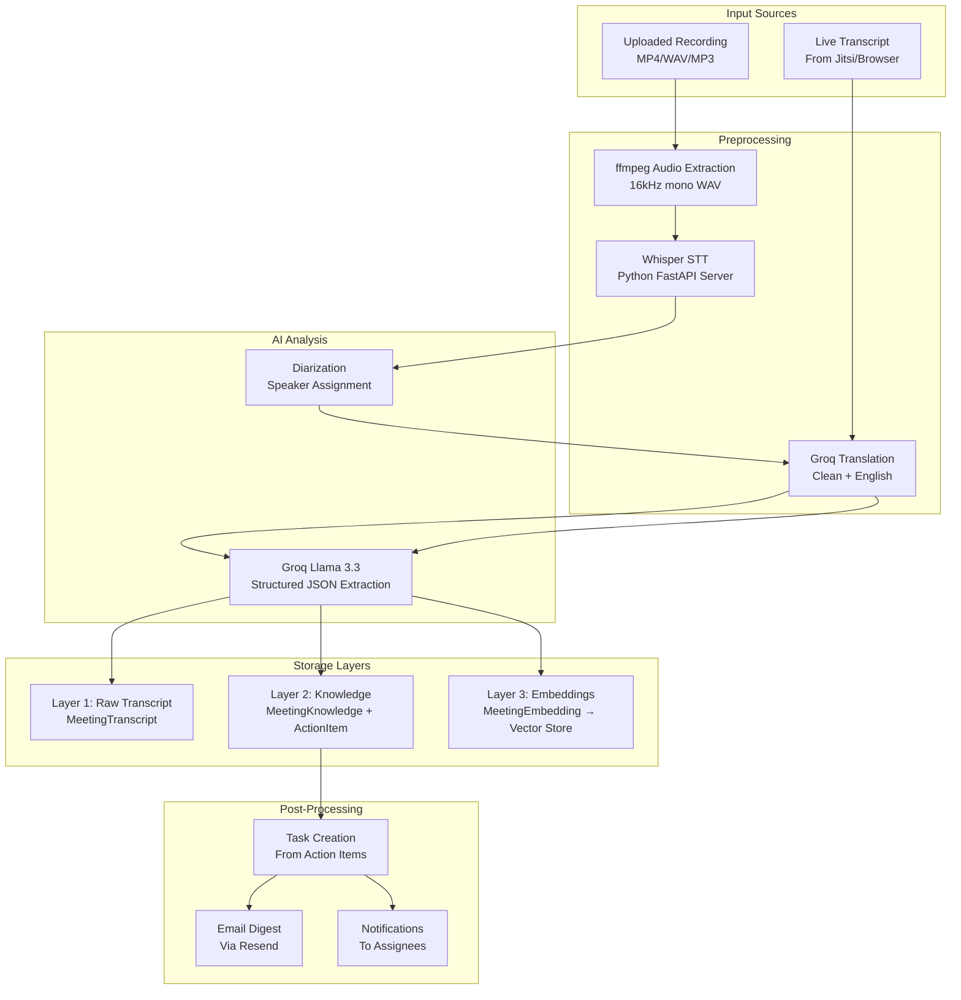
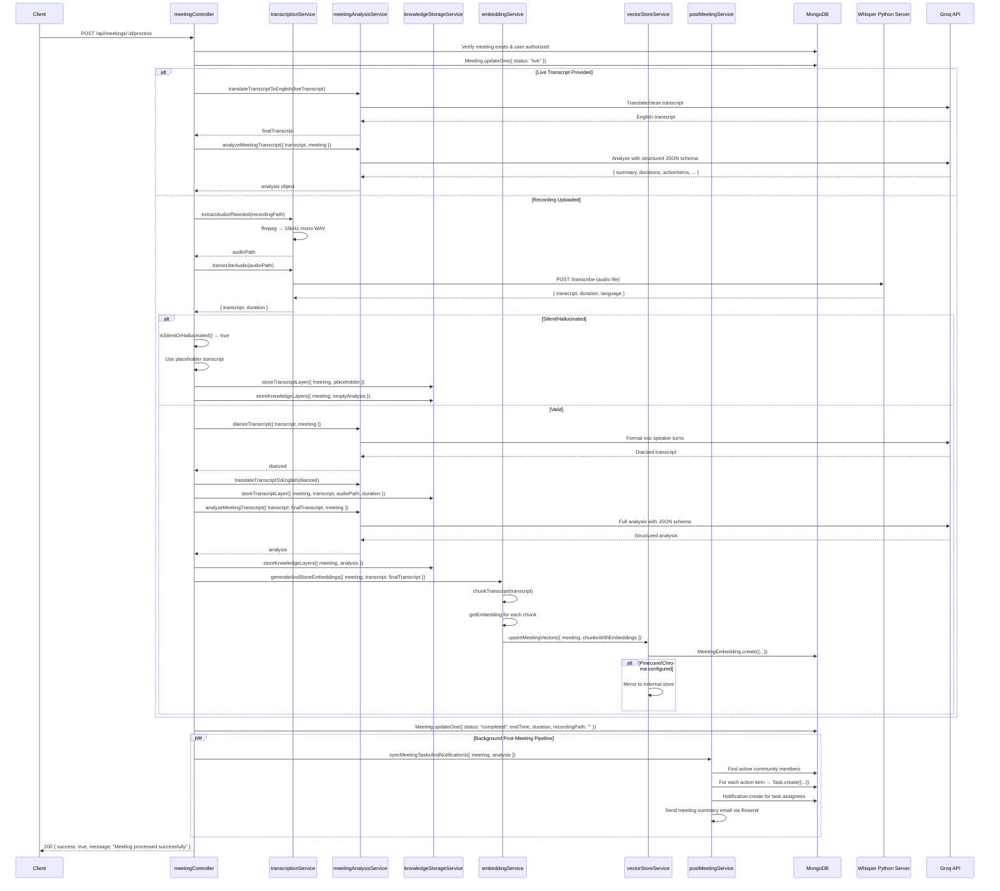

# SmartMeet — Meetings Module

## Feature Overview

The Meetings module is the core feature of SmartMeet. It handles the complete meeting lifecycle: scheduling, recording, transcription, AI analysis, knowledge extraction, and post-meeting task synchronization. Every meeting produces three layers of structured data: raw transcript, AI-generated knowledge, and vector embeddings for semantic search.

## Data Model

**Model File:** `Back-end/src/models/Meeting.js`

**Schema:**
```javascript
{
  title: String,           // Required — meeting title
  description: String,     // Optional — meeting description
  host: ObjectId,          // FK → User — meeting host/organizer
  participants: [{         // Participant list
    name: String,
    email: String,
    role: String
  }],
  startTime: Date,         // Scheduled start
  endTime: Date,           // Actual end time (set on completion)
  duration: Number,        // Duration in minutes
  type: String,            // Enum: Personal, PersonalDiscussion, Team, Client,
                           //       Standup, Brainstorm, Other
  status: String,          // Enum: scheduled, live, completed, cancelled
  recordingPath: String,   // Server path to uploaded recording file
  meetingLink: String,     // External meeting URL (e.g., Jitsi)
  meetingId: String,       // Unique 24-hex-char identifier
}
```

## AI Processing Pipeline



## API Endpoints

### Meeting CRUD

| Method | Endpoint | Auth | Description |
|---|---|---|---|
| GET | `/api/meetings` | protect | List meetings (permission-scoped) |
| POST | `/api/meetings` | protect | Create meeting |
| GET | `/api/meetings/:id` | protect | Get single meeting |
| PUT | `/api/meetings/:id` | protect | Update meeting |
| DELETE | `/api/meetings/:id` | protect | Delete meeting (host only) |
| POST | `/api/meetings/:id/upload-recording` | protect | Upload recording file |
| POST | `/api/meetings/:id/process` | protect | Trigger AI processing pipeline |

### Meeting Knowledge Retrieval

| Method | Endpoint | Description |
|---|---|---|
| GET | `/api/meetings/:id/transcript` | Raw transcript text + chunks |
| GET | `/api/meetings/:id/summary` | AI summary + overview + topics |
| GET | `/api/meetings/:id/knowledge` | Full MeetingKnowledge document |
| GET | `/api/meetings/:id/tasks` | Extracted action items |
| GET | `/api/meetings/:id/decisions` | Decisions made in the meeting |

### Live Extraction (During Meeting)

| Method | Endpoint | Description |
|---|---|---|
| POST | `/api/meetings/live-extract-task` | Extract tasks from live text snippet |
| POST | `/api/meetings/live-extract-decision` | Extract decisions from live text snippet |

## Permission Scoping

The meeting system uses a sophisticated OR-clause permission model for data access:

```javascript
// Admin sees:
// 1. Meetings they hosted
// 2. Meetings where they are a participant (non-Team type)
const adminClauses = [
  { host: req.user._id },
  { "participants.email": req.user.email, type: { $ne: "Team" } },
];

// Member sees:
// 1. Meetings they hosted
// 2. Meetings where they are a participant (any type)
// 3. Team meetings hosted by same-community admins
const memberClauses = [
  { host: req.user._id },
  { "participants.email": req.user.email },
  { "participants.name": req.user.name },
  { host: { $in: sameCommunityAdminIds }, type: "Team" },
];
```

## AI Processing - Detailed Sequence



## Meeting Knowledge Storage

### Layer 1: Raw Transcript (`MeetingTranscript`)
- Full free-text transcript
- Chunk metadata (index, start/end char, token estimate, vectorId)
- Source audio path and duration
- One document per meeting (upserted)

### Layer 2: Knowledge (`MeetingKnowledge` + `ActionItem`)
- Executive summary
- Meeting overview narrative
- Structured arrays: decisions, deadlines, risks, open questions, topics, agreements, disagreements, follow-up tasks, action items
- Each item has: `{ text, owner, deadline, confidence }`
- Action items stored separately in `ActionItem` collection for task synchronization
- Old ActionItems deleted and replaced on each analysis (no versioning)

### Layer 3: Embeddings (`MeetingEmbedding`)
- One document per transcript chunk
- 384-dimensional embedding vector (select: false — hidden from normal queries)
- vectorId for external vector store reference
- metadata Map for flexible storage

## Live Extraction

During a live meeting, participants can extract tasks and decisions in real time:

```javascript
// POST /api/meetings/live-extract-task
liveExtractTaskFromText(text) → Groq call → { title, description, assignee, deadline }

// POST /api/meetings/live-extract-decision
liveExtractDecisionFromText(text) → Groq call → { text, owner, deadline }
```

Both have fallback keyword-matching logic when Groq is unavailable.

## Post-Meeting Service

The `postMeetingService.syncMeetingTasksAndNotifications()` runs as a background async job (not awaited):

1. **Fetch community members:** All active members of the meeting's community
2. **For each action item from analysis:**
   - Match assignee name/email to a community user
   - **Safeguard:** Never assign tasks to admin users (admins are reviewers, not doers)
   - Create a `Task` document with `source: "Meeting: {title}"` and `meeting` reference
   - Send notification to the matched assignee
3. **If meeting hosted by admin:**
   - Create meeting summary notification for all community members
   - Send HTML email digest via Resend with summary, decisions, and tasks

## Error Handling

| Scenario | Behavior |
|---|---|
| No transcript + no recording | Meeting marked completed, no AI analysis |
| Silent/hallucinated recording | Placeholder transcript, empty analysis, no task creation |
| Groq API failure | Falls back to keyword extraction or mock analysis |
| ffmpeg not found | Uses `process.env.FFMPEG_PATH` or defaults to "ffmpeg" |
| STT server unavailable | Error logged, meeting stays in "live" state |
| Audio extraction failure | Error logged, cleanup attempted |
| Post-meeting pipeline error | Error logged silently (background fire-and-forget) |

## Files Involved

| File | Role |
|---|---|
| `Back-end/src/models/Meeting.js` | Meeting schema and model |
| `Back-end/src/models/MeetingTranscript.js` | Raw transcript storage |
| `Back-end/src/models/MeetingKnowledge.js` | AI analysis storage |
| `Back-end/src/models/MeetingEmbedding.js` | Vector embedding storage |
| `Back-end/src/models/ActionItem.js` | Extracted action items |
| `Back-end/src/controllers/meetingController.js` | Meeting CRUD + processing |
| `Back-end/src/controllers/meetingKnowledgeController.js` | Knowledge retrieval |
| `Back-end/src/routes/meetingRoutes.js` | Route definitions |
| `Back-end/src/services/transcriptionService.js` | Audio extraction + STT |
| `Back-end/src/services/meetingAnalysisService.js` | Groq-based analysis |
| `Back-end/src/services/knowledgeStorageService.js` | MongoDB storage |
| `Back-end/src/services/embeddingService.js` | Local embedding generation |
| `Back-end/src/services/vectorStoreService.js` | Vector store abstraction |
| `Back-end/src/services/chunkingService.js` | Text chunking |
| `Back-end/src/services/postMeetingService.js` | Task sync + email digests |
| `Back-end/src/services/emailService.js` | Email sending (Resend) |
| `stt-server/main.py` | Whisper STT Python server |

## Storage Impact

| Item | Size Estimate | Storage |
|---|---|---|
| Meeting document | ~500 bytes | MongoDB |
| Raw transcript | ~1-50 KB | MongoDB (text) |
| MeetingKnowledge | ~2-20 KB | MongoDB (structured) |
| ActionItem (per item) | ~200-500 bytes | MongoDB |
| Embedding vector | 384 × 4 bytes = 1.5 KB | MongoDB + Pinecone/Chroma |
| Audio recording | 10-500 MB | Filesystem (temporary, deleted after processing) |
