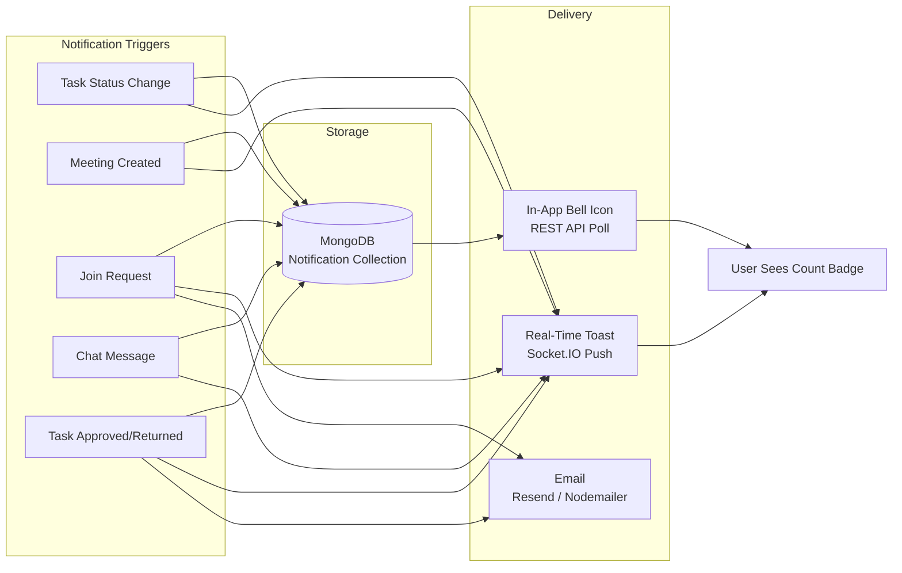

# SmartMeet — Notifications Module

## Feature Overview

SmartMeet has a comprehensive in-app notification system that alerts users about important events in real time. Notifications are stored in MongoDB, delivered via Socket.IO for instant updates, and can be managed through REST API endpoints. Each user has configurable notification preferences.

## Data Model

**File:** `Back-end/src/models/Notification.js`

```javascript
{
  recipient: ObjectId,   // FK → User (required) — who receives this notification
  community: ObjectId,   // FK → Community (nullable) — related workspace
  type: String,          // Enum: join-request | task | meeting | document | approval | rejection | chat
  title: String,         // Required — short title
  message: String,       // Required — body text
  relatedId: ObjectId,   // Polymorphic reference to related entity
  status: String,        // Enum: pending | approved | rejected (for join-request notifications)
  read: Boolean,         // Default: false
  createdAt: Date,       // Auto
  updatedAt: Date,       // Auto
}
```

**Indexes:**
- `{ recipient: 1, read: 1 }` — efficient queries for unread notifications
- `{ community: 1 }` — community-scoped queries

## Notification Types

| Type | Purpose | Typical Title | Trigger |
|---|---|---|---|
| `join-request` | New user wants to join community | "New Join Request" | `POST /api/join-requests` |
| `task` | Task status change or assignment | "Task Ready For Review" | Task submission, assignment |
| `meeting` | Meeting invitation or summary | "Meeting Invitation: Q3 Sync" | Meeting creation, processing |
| `document` | Document shared (future use) | "New document uploaded" | (Not yet implemented) |
| `approval` | Join request or task approved | "Your task has been approved" | Approve task or join request |
| `rejection` | Join request or task rejected | "Your task has been returned" | Reject task or join request |
| `chat` | New community chat message | "New message from John" | `chat:send` socket event |

## Delivery Methods



## Notification Triggers in Code

### 1. Join Request Submitted
**File:** `Back-end/src/controllers/joinRequestController.js`

```javascript
await Notification.create({
  recipient: community.owner,
  community: community._id,
  type: "join-request",
  title: "New Join Request",
  message: `${user.name} wants to join your community.`,
  relatedId: joinRequest._id,
  status: "pending",
});
```

### 2. Join Request Approved
**File:** `Back-end/src/controllers/joinRequestController.js`

```javascript
await Notification.create({
  recipient: joinRequest.user,
  community: joinRequest.community,
  type: "approval",
  title: "Join Request Approved",
  message: `Your request to join ${communityName} has been approved.`,
  relatedId: joinRequest._id,
  status: "approved",
});
```

### 3. Join Request Rejected
**File:** `Back-end/src/controllers/joinRequestController.js`

```javascript
await Notification.create({
  recipient: joinRequest.user,
  community: joinRequest.community,
  type: "rejection",
  title: "Join Request Rejected",
  message: `Your request to join ${communityName} has been rejected.`,
  relatedId: joinRequest._id,
  status: "rejected",
});
```

### 4. Meeting Invitation
**File:** `Back-end/src/controllers/meetingController.js`

```javascript
await Notification.create({
  recipient: user._id,
  community: communityId,
  type: "meeting",
  title: `Meeting Invitation: ${title}`,
  message: `You are invited to "${title}" on ${dateStr} at ${timeStr}. Organized by ${hostName}.`,
  relatedId: meeting._id,
});
// Also emits socket event "meeting:notification"
```

### 5. Task Submitted for Review
**File:** `Back-end/src/controllers/taskController.js`

```javascript
for (const admin of adminUsers) {
  await Notification.create({
    recipient: admin._id,
    community: task.community,
    type: "approval",
    title: "Task Ready For Review",
    message: `${senderName} marked "${taskTitle}" as ready for review.`,
    relatedId: task._id,
  });
}
// Also emits socket event "task:notification" to all admin sockets
```

### 6. Task Approved
**File:** `Back-end/src/controllers/taskController.js`

```javascript
await Notification.create({
  recipient: task.user,
  community: task.community,
  type: "approval",
  title: "Task Approved",
  message: `Your task "${taskTitle}" has been approved.`,
  relatedId: task._id,
});
// Also emits socket event to assignee
```

### 7. Task Returned
**File:** `Back-end/src/controllers/taskController.js`

```javascript
await Notification.create({
  recipient: task.user,
  community: task.community,
  type: "rejection",
  title: "Task Returned",
  message: `${adminName} requested changes on "${taskTitle}".`,
  relatedId: task._id,
});
// Also emits socket event to assignee
```

### 8. Chat Message
**File:** `Back-end/src/socket/communityChat.socket.js`

```javascript
for (const member of communityMembers) {
  await Notification.create({
    recipient: member._id,
    community: communityId,
    type: "chat",
    title: `New message from ${senderName}`,
    message: text.length > 100 ? text.slice(0, 100) + "…" : text,
    relatedId: populated._id,
  });
}
// Also emits socket event "chat:notification" to online members
```

## API Endpoints

| Method | Endpoint | Auth | Description |
|---|---|---|---|
| GET | `/api/notifications` | protect | List all notifications (newest first) |
| POST | `/api/notifications` | protect | Create notification manually |
| PUT | `/api/notifications/read-all` | protect | Mark all as read |
| PUT | `/api/notifications/:id/read` | protect | Mark single as read |
| DELETE | `/api/notifications/:id` | protect | Delete single notification |
| DELETE | `/api/notifications` | protect | Clear all notifications |

## Socket Events

| Event | Direction | Payload | Trigger |
|---|---|---|---|
| `task:notification` | Server → Client | `{ type, title, message, relatedId }` | Task submitted/approved/returned |
| `meeting:notification` | Server → Client | `{ type, title, message, relatedId }` | Meeting created with participants |
| `chat:notification` | Server → Client | `{ type, title, message }` | New chat message in community |
| `session:revoked` | Server → Client | — | Session deleted by user |

## Notification Settings

Each user has configurable notification preferences stored in `User.notificationSettings`:

```javascript
{
  summaries: Boolean,        // Daily/weekly summary emails
  reports: Boolean,          // Report notifications
  digestTime: String,        // Preferred digest time
  reminderWindow: String,    // Reminder time window
  quietHours: Object,        // Do-not-disturb hours
  pushDesktop: Boolean,      // Desktop push notifications
  pushMobile: Boolean,       // Mobile push notifications
}
```

**API Endpoints:**
- `GET /api/users/notification-settings` (protected)
- `PUT /api/users/notification-settings` (protected)

## Frontend Integration

**Pinia Store:** `Front-end/src/stores/notification.js`

```javascript
state: {
  notifications: [],    // Array of notification objects
  loading: false,
}

getters: {
  unreadCount: computed(() => notifications.filter(n => !n.read).length),
}

actions: {
  fetchNotifications(),     // GET /api/notifications
  addNotification(data),    // POST /api/notifications
  markAsRead(id),           // PUT /api/notifications/:id/read
  markAllAsRead(),          // PUT /api/notifications/read-all
  clearAll(),               // DELETE /api/notifications
}
```

The notification store is updated both by REST API calls and by Socket.IO events. When a socket notification arrives, the frontend can either re-fetch the list (for new task/meeting/chat notifications) or append to the existing list.

## Architecture Diagram

```mermaid
graph TD
    subgraph Triggers
        A[Task Controller]
        B[Meeting Controller]
        C[Join Request Controller]
        D[Chat Socket]
    end

    subgraph Creation["Notification Creation"]
        E[Notification.create()]
        F[Socket.IO Emit]
    end

    subgraph Frontend["Frontend Display"]
        G[Bell Icon Badge<br/>unreadCount]
        H[Notification Dropdown]
        I[Toast Notification]
    end

    A --> E
    A --> F
    B --> E
    B --> F
    C --> E
    D --> E
    D --> F

    E --> G
    E --> H
    F --> I
```

## Performance Considerations

- Notifications are indexed by `{ recipient: 1, read: 1 }` for fast unread queries
- Socket.IO events are batched — the system emits to each recipient's sockets individually
- Chat notifications create one MongoDB document per recipient (not one shared document)
- `createNotification` service has a try/catch wrapper and returns null on failure (fire-and-forget)
- No TTL index is set on notifications — they persist indefinitely (consider adding TTL for old read notifications)
