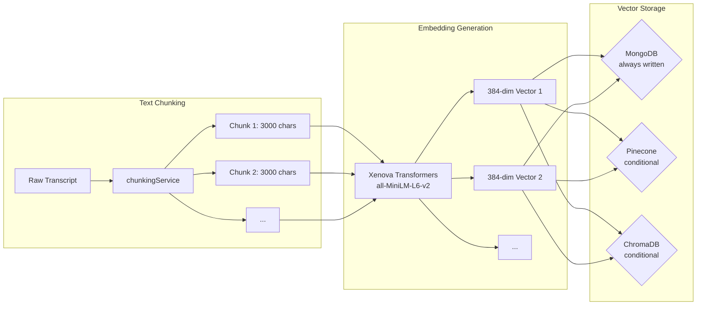
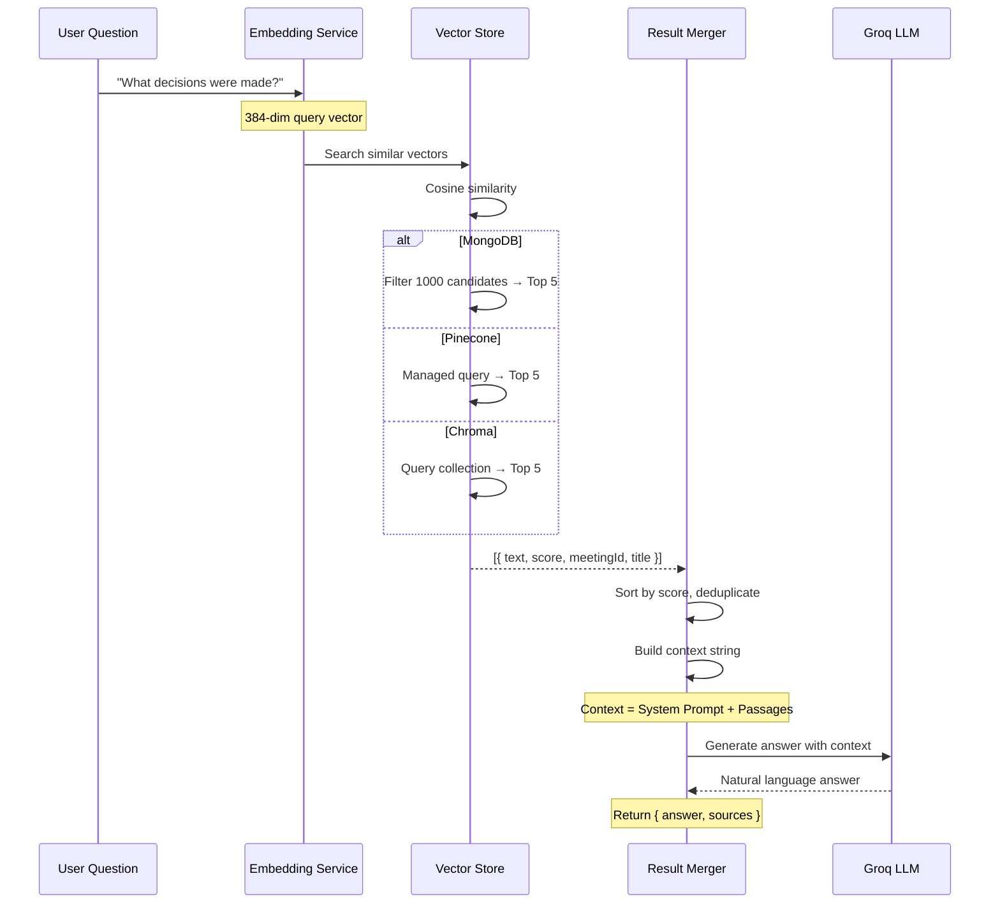

# SmartMeet — RAG & Embeddings Architecture

## Overview

SmartMeet implements a complete **Retrieval-Augmented Generation** pipeline that converts meeting transcripts into searchable vector embeddings and enables natural language querying. The system supports three vector store providers and generates embeddings entirely locally.

## Embedding Pipeline



## Vector Store Providers

### MongoDB (Default + Always-On)

The `MeetingEmbedding` collection in MongoDB always stores vectors regardless of the configured provider. This serves as:
- The primary vector store when no external provider is configured
- A backup/failover when Pinecone/Chroma is in use
- A source for direct chunk retrieval (title-matching boost in RAG)

**Storage Format:**
```javascript
{
  meeting: ObjectId,     // FK → Meeting
  vectorId: String,      // Unique identifier
  chunkIndex: Number,    // Position in transcript
  text: String,          // Chunk text content
  embedding: Number[],   // 384 floats (select: false)
  metadata: Map,         // Flexible metadata
}
```

**Query Strategy:**
```javascript
// Cosine similarity search over MongoDB vectors
1. Find up to 1000 candidate embeddings (filtered by meeting if scoped)
2. Compute cosine similarity for each: (a·b) / (|a|×|b|)
3. Return top K results sorted by similarity
```

### Pinecone (Production)

Configured via environment variable `VECTOR_STORE_PROVIDER=pinecone`.

**Configuration:**
- API Key: `PINECONE_API_KEY`
- Index Name: `PINECONE_INDEX` (default: `smartmeet-meetings`)
- Namespaces: Supports multi-tenancy via namespace isolation

**Vector Dimensions:** 384 (matching `all-MiniLM-L6-v2` output)

### ChromaDB (Local Development)

Configured via environment variable `VECTOR_STORE_PROVIDER=chroma`.

**Configuration:**
- Host: `CHROMA_HOST` (default: `localhost`)
- Port: `CHROMA_PORT` (default: `8000`)
- Collection: `smartmeet_meetings`
- Distance: Cosine similarity (`hnsw:space: cosine`)

## Similarity Computation

```javascript
const cosineSimilarity = (a, b) => {
  if (!a || !b || a.length !== b.length || a.length === 0) return 0;
  
  let dotProduct = 0, magnitudeA = 0, magnitudeB = 0;
  
  for (let i = 0; i < a.length; i++) {
    dotProduct += a[i] * b[i];
    magnitudeA += a[i] * a[i];
    magnitudeB += b[i] * b[i];
  }
  
  magnitudeA = Math.sqrt(magnitudeA);
  magnitudeB = Math.sqrt(magnitudeB);
  
  if (magnitudeA === 0 || magnitudeB === 0) return 0;
  return dotProduct / (magnitudeA * magnitudeB);
};
```

## Text Chunking Strategies

### For Embeddings (Semantic Search)
```javascript
chunkTranscript(transcript, { chunkSize: 3000, overlap: 350 })
```
- Breaks transcript into 3000-character chunks with 350-character overlap
- Respects sentence boundaries (`. `)
- Falls back to line breaks, then character position
- Each chunk gets: `{ index, text, startChar, endChar, tokenEstimate }`

### For AI Analysis (Groq Context)
```javascript
chunkForAnalysis(transcript, { chunkSize: 9000, overlap: 500 })
```
- Larger chunks (9000 chars) for LLM context window efficiency
- Used in `meetingAnalysisService` for long meeting analysis
- Multiple chunks are analyzed separately then merged

## The RAG Query Pipeline



## Environmental Configuration

| Variable | Default | Purpose |
|---|---|---|
| `VECTOR_STORE_PROVIDER` | `"mongo"` | Active vector store: `mongo`, `pinecone`, or `chroma` |
| `PINECONE_API_KEY` | — | Pinecone API key |
| `PINECONE_INDEX` | `"smartmeet-meetings"` | Pinecone index name |
| `CHROMA_HOST` | `"localhost"` | ChromaDB host |
| `CHROMA_PORT` | `"8000"` | ChromaDB port |
| `GROQ_API_KEY` | — | Groq API key for LLM |
| `GROQ_MODEL` | `"llama-3.3-70b-versatile"` | Groq model for analysis |

## Embedding Model Details

| Property | Value |
|---|---|
| Model | `Xenova/all-MiniLM-L6-v2` |
| Implementation | `@xenova/transformers` (ONNX runtime) |
| Dimensions | 384 |
| Distance Metric | Cosine Similarity |
| Execution | Local CPU (Node.js) |
| Cost | $0 (no API calls) |
| Singleton | Pipeline loaded once, shared across all requests |
| Speed | ~100ms per chunk (CPU-dependent) |

## Why Local Embeddings?

| Factor | Local (Xenova) | API-based (OpenAI) |
|---|---|---|
| Cost | Free | $0.0001/1K tokens |
| Latency | ~100ms | ~200-500ms + network |
| Privacy | Data stays on server | Sent to third party |
| Dependency | None | API key, internet |
| Quality | 384-dim (sufficient) | 1536-dim (higher) |

The choice of `all-MiniLM-L6-v2` balances quality and performance for meeting transcript chunk retrieval, where the semantic distinctions are relatively broad (different topics, decisions, action items) and do not require the ultra-high dimensionality of OpenAI's `text-embedding-3-small`.
