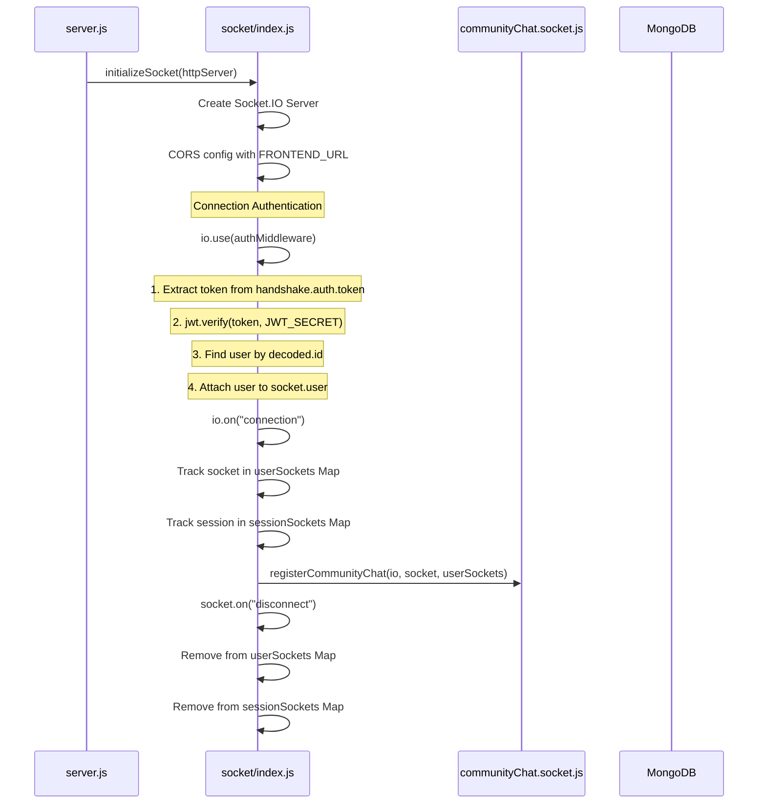
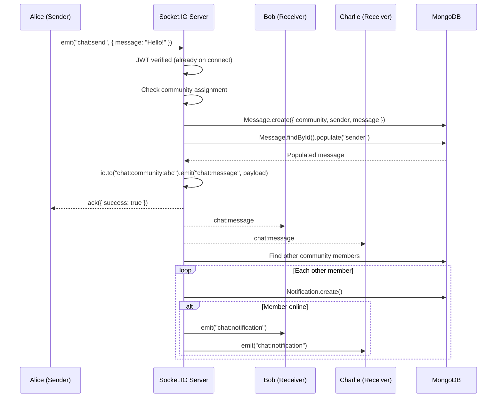
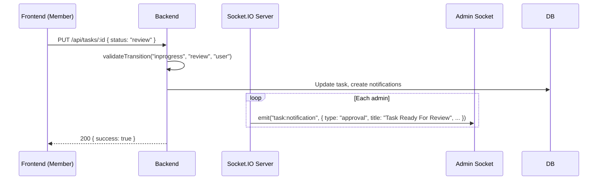
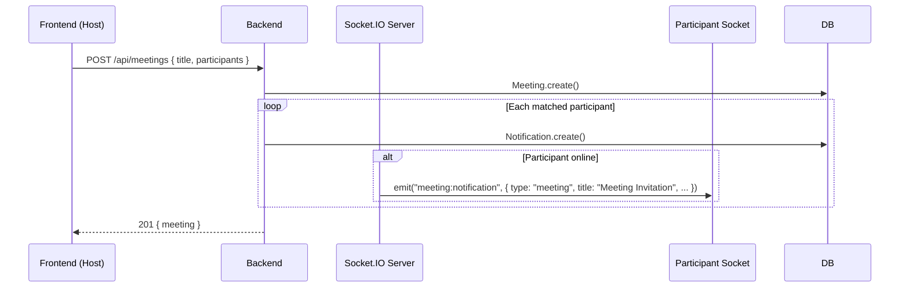

# SmartMeet — Socket Events Reference

## Overview

SmartMeet uses **Socket.IO** for all real-time communication. The socket server is initialized in `server.js`, configured in `socket/index.js`, and handles two categories of events: **community chat** and **system notifications**.

## Server Initialization



## Data Structures

```javascript
// Map: userId → Set of socketIds
const userSockets = new Map();
// Example: { "user123" → Set{"socketA", "socketB"} }

// Map: sessionId → socket
const sessionSockets = new Map();
// Example: { "session456" → socketInstance }
```

## Connection Authentication

Every socket connection must provide a JWT token:

```javascript
const socket = io("http://localhost:5000", {
  auth: { token: "Bearer <jwt_token>" }
});
```

The server middleware:
1. Extracts token from `socket.handshake.auth.token`
2. Verifies with `jwt.verify(token, JWT_SECRET)`
3. Loads user from database (with community populated)
4. Attaches `socket.user` and `socket.sessionId`
5. Rejects connection with error if invalid

## Event Catalog

### Community Chat Events

| Event | Direction | Payload | Description |
|---|---|---|---|
| `chat:send` | Client → Server | `{ message: string }` | Send a chat message |
| `chat:message` | Server → Room | `{ _id, sender, message, createdAt }` | Broadcast message to community room |
| `chat:notification` | Server → Individual | `{ type: "chat", title, message }` | Chat notification to online members |
| `chat:error` | Server → Individual | `{ error: string }` | Error response |

### Notification Events

| Event | Direction | Payload | Description |
|---|---|---|---|
| `task:notification` | Server → Individual | `{ type, title, message, relatedId }` | Task status change notification |
| `meeting:notification` | Server → Individual | `{ type, title, message, relatedId }` | Meeting invitation notification |
| `chat:notification` | Server → Individual | `{ type, title, message }` | Chat message notification |

### Session Events

| Event | Direction | Payload | Description |
|---|---|---|---|
| `session:revoked` | Server → Individual | None | Session deleted by user |

## Event Flow Diagrams

### Chat Message Flow



### Task Notification Flow



### Meeting Invitation Flow



## Utility Exports

```javascript
// Socket/index.js exports:
export const initializeSocket = (server) => { /* ... */ };
export const getIO = () => { /* returns Socket.IO server instance */ };
export const getUserSockets = () => { /* returns userSockets Map */ };
export const getSocketBySessionId = (sessionId) => { /* ... */ };
```

## How Other Modules Use Sockets

```javascript
// In any controller:
import { getIO, getUserSockets } from "../socket/index.js";

const io = getIO();
const userSocketsMap = getUserSockets();

// Send to specific user
const sockets = userSocketsMap.get(userId);
if (sockets) {
  for (const sid of sockets) {
    io.to(sid).emit("event:name", payload);
  }
}
```

## Connection Management

```javascript
// Server configuration
const io = new Server(server, {
  cors: {
    origin: process.env.FRONTEND_URL || "http://localhost:5173",
    methods: ["GET", "POST"],
    credentials: true,
  },
  pingInterval: 25000,    // 25s ping to keep connection alive
  pingTimeout: 20000,      // 20s to respond before disconnect
});
```

## Disconnect Cleanup

On socket disconnect, the server:
1. Removes the socket ID from the user's socket Set
2. If the user has no more sockets, removes the user from the Map entirely
3. If the socket was associated with a session, removes the session-to-socket mapping

## Error Handling

| Error | Behavior |
|---|---|
| No token provided | `next(new Error("Authentication required."))` |
| Invalid/expired token | `next(new Error("Invalid token."))` |
| User not found | `next(new Error("User not found."))` |
| Socket.IO not initialized | `getIO()` throws `Error("Socket.IO not initialized.")` |

## Security

- Every socket connection is authenticated with JWT
- Chat messages are validated server-side (non-empty, max 5000 chars)
- Community membership is verified before joining rooms
- Community chat rooms are isolated per community ID — no cross-community message leaks
- Socket connection can be forced-disconnected via `socket.disconnect(true)` if user has no community
