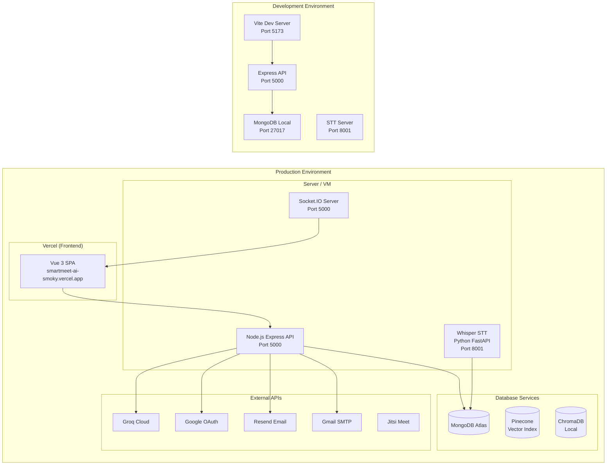
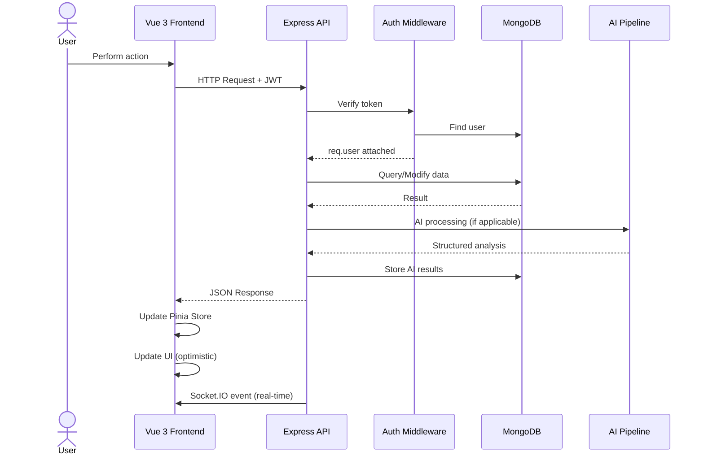

# SmartMeet — System Overview

## 1. What Problem Does SmartMeet Solve?

Modern teams waste 30% of meeting time on manual note-taking, task tracking, and follow-ups. SmartMeet is an **AI-powered workspace collaboration platform** that automates the entire meeting lifecycle — from scheduling and transcription to analysis, task extraction, and knowledge retrieval.

The platform solves:

| Problem | SmartMeet Solution |
|---|---|
| Manual meeting notes | Automatic speech-to-text transcription via Whisper |
| Forgotten decisions | AI extracts decisions, action items, risks, and deadlines in real time |
| Task disintegration | Auto-creates tasks from meeting action items and assigns them |
| Knowledge silos | Retrieval-Augmented Generation (RAG) across all meeting transcripts |
| Workspace fragmentation | Multi-tenant community system with isolated data per workspace |
| Delayed approvals | Role-based task workflow with real-time notifications |

## 2. Who Uses It?

| Role | Description |
|---|---|
| **Admin** | Workspace owner who creates communities, invites members, reviews tasks, manages the team, and accesses analytics |
| **Member** | Team member who attends meetings, receives AI-generated tasks, and uses Knowledge AI for retrieval |
| **System** | Self-contained AI pipeline with STT server, embedding generator, and vector database |

## 3. Main Modules

### 3.1 Authentication & User Management
- JWT-based authentication with refresh token rotation
- Google OAuth 2.0 integration
- TOTP-based two-factor authentication via speakeasy
- Password reset with token expiry
- Session management with device fingerprinting (ua-parser-js)
- Role-based access control (admin / user)

### 3.2 Community System (Multi-Tenancy)
- Isolated workspaces called Communities
- Each community has a unique 8-character alphanumeric invitation code
- Join request workflow: user requests → admin approves/rejects
- Absolute data isolation — no cross-community data access
- Community-level member management

### 3.3 Meeting Intelligence
- Jitsi Meet integration for video conferencing
- Recording upload and storage
- Automatic audio extraction via ffmpeg
- Speech-to-text transcription via Whisper (external Python STT server)
- AI-powered transcript cleaning and English translation via Groq (Llama 3.3)
- Full meeting analysis: summary, decisions, action items, deadlines, risks, topics, agreements, disagreements
- Structured knowledge storage (MeetingKnowledge, ActionItems, MeetingTranscript)
- Live task and decision extraction during meetings
- Post-meeting task synchronization and email digests

### 3.4 Task Management
- Role-based workflow: To Do → In Progress → Review → Done
- Admin only on Review: approve or return
- Members move through To Do → In Progress → Review
- Drag-and-drop Kanban board interface
- Optimistic UI updates with rollback
- Review history with audit trail
- Notifications on: submit for review, approve, return

### 3.5 Knowledge AI (RAG Engine)
- Semantic search across all meeting transcripts
- Local embedding generation via Xenova Transformers (all-MiniLM-L6-v2, 384-dim)
- Multi-provider vector storage: MongoDB, Pinecone, or ChromaDB
- Groq-powered conversational AI with context from retrieved passages
- Chat session management with message history
- Relative-time query detection ("what happened in the last meeting?")
- Title-matching boost for meeting-specific questions

### 3.6 Notifications
- In-app notification system with read/unread tracking
- Real-time delivery via Socket.IO
- Notification types: meeting, task, approval, rejection, join-request, chat, document
- Per-user notification settings (summaries, quiet hours, push preferences)

### 3.7 Community Chat
- Real-time group chat via Socket.IO
- Message persistence in MongoDB
- Server-side event broadcasting to all community members
- Chat notifications with message previews

### 3.8 Dashboard & Analytics
- Weekly meeting and task statistics
- Activity chart with bar-normalized daily completions
- AI-powered insights: burnout risk detection, overdue warnings
- Full team analytics: completion rates, performance scores, top contributors, AI usage metrics

### 3.9 Invitation System
- Email invitations via Resend API
- Styled HTML templates with workspace details
- Dual flow: accept (new user registration) or claim (existing user)
- Token-based verification with expiry

### 3.10 Subscription Management
- Per-user subscription tracking (plan, price, billing cycle)
- Stripe customer ID integration ready

## 4. High-Level Architecture


## 5. Component Architecture

```mermaid
graph TB
    subgraph Frontend["Frontend (Vue 3 SPA - Port 5173)"]
        A[App.vue] --> B[Router]
        B --> C[Public Views<br/>Home, Features, Pricing]
        B --> D[Auth Views<br/>SignIn, SignUp, Register]
        B --> E[App Views<br/>Dashboard, Tasks, Meetings,<br/>KnowledgeAI, CommunityChat]
        E --> F[Dashboard Components]
        E --> G[Task Components]
        E --> H[Meeting Components]
        F --> I[Pinia Stores<br/>auth, ui, dashboard, task,<br/>meeting, notification, alert]
        I --> J[Axios HTTP Client]
        I --> K[Socket.IO Client]
    end

    subgraph Backend["Backend (Express - Port 5000)"]
        L[Express App] --> M[Middleware Stack<br/>CORS, JSON, Static]
        M --> N[Route Groups]
        N --> O1[/api/users<br/>userRoutes]
        N --> O2[/api/meetings<br/>meetingRoutes]
        N --> O3[/api/tasks<br/>taskRoutes]
        N --> O4[/api/rag<br/>ragRoutes]
        N --> O5[/api/notifications<br/>notificationRoutes]
        N --> O6[/api/communities<br/>communityRoutes]
        N --> O7[/api/join-requests<br/>joinRequestRoutes]
        N --> O8[/api/community-chat<br/>communityChatRoutes]
        N --> O9[/api/invitations<br/>invitationRoutes]
        N --> O10[/api/dashboard<br/>dashboardRoutes]
        N --> O11[/api/subscription<br/>subscriptionRoutes]
        O1 --> P[userController]
        O2 --> Q[meetingController]
        O3 --> R[taskController]
        O4 --> S[ragController]
        O5 --> T[notificationController]
        O6 --> U[communityController]
        O7 --> V[joinRequestController]
        O8 --> W[communityChatController]
        O9 --> X[invitationController]
        O10 --> Y[dashboardController]
        O11 --> Z[subscriptionController]
    end

    subgraph Services["Service Layer"]
        S1[transcriptionService] --> STT
        S2[meetingAnalysisService] --> GROQ
        S3[embeddingService] --> XENOVA
        S4[vectorStoreService] --> VS
        S5[ragService]
        S6[knowledgeStorageService]
        S7[postMeetingService]
        S8[emailService] --> RESEND
        S9[notificationService]
        S10[chunkingService]
    end

    P --> S1
    Q --> S1 & S2 & S6 & S7
    S --> S3 & S4 & S5 & S10

    subgraph External["External Services"]
        STT[Whisper STT<br/>Python/FastAPI - Port 8001]
        GROQ[Groq Cloud<br/>Llama 3.3 70B]
        XENOVA[Xenova Transformers<br/>all-MiniLM-L6-v2]
        VS[(Vector Store<br/>MongoDB / Pinecone / Chroma)]
        RESEND[Resend API<br/>Transactional Email]
        SMTP[Gmail SMTP<br/>Password Reset]
    end

    J --> Backend
    K --> MS[Socket.IO Server]
    MS --> K
```

## 6. Deployment Architecture



## 7. Key Design Decisions

| Decision | Rationale |
|---|---|
| **Node.js + Express** | Non-blocking I/O ideal for real-time features and AI pipeline orchestration |
| **MongoDB + Mongoose** | Schema flexibility for evolving meeting intelligence data shapes; rich document model for nested knowledge structures |
| **Multi-provider vector store** | MongoDB default for simplicity; Pinecone for production-scale; Chroma for local development |
| **Local embeddings (Xenova)** | Zero-cost embedding generation; no external API calls; runs entirely on CPU |
| **Groq (not OpenAI)** | Significantly lower latency (8x faster than GPT-4) and cost-effective for high-volume transcript analysis |
| **Whisper (local STT)** | Data sovereignty — audio never leaves the server; no per-minute transcription costs |
| **Socket.IO** | Bidirectional real-time for community chat, meeting notifications, and session management |
| **Dual email system** | Resend for styled transactional emails (invitations, summaries); Gmail SMTP for password resets |
| **Pinia over Vuex** | Lighter weight, better TypeScript support, simpler API — matches Vue 3 composition API |
| **Optimistic UI updates** | Tasks use optimistic updates with rollback on failure for a responsive drag-and-drop experience |

## 8. Data Flow Overview


