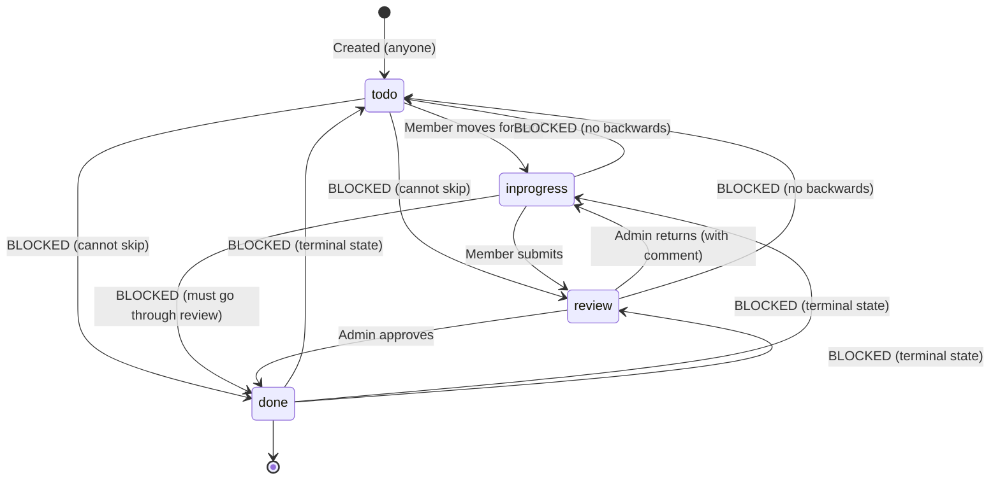

# SmartMeet — Tasks Module

## Feature Overview

The Tasks module implements a **strict role-based workflow** where tasks progress through four stages: To Do → In Progress → Review → Done. The workflow is enforced both on the backend (via a centralized validation utility) and on the frontend (via role-specific UI rendering). Admins act as reviewers who approve or return tasks; assigned members move tasks through the active stages.

## Workflow State Machine



### Transition Rules

| From | To | Allowed Roles | Notes |
|---|---|---|---|
| todo | inprogress | Member | Member starts working |
| inprogress | review | Member | Member submits for review |
| review | done | Admin | Admin approves |
| review | inprogress | Admin | Admin returns with comment |
| Any | Any | None | All other transitions blocked |

### What Admin CANNOT Do

- Move any task from todo or inprogress
- Drag any card on the Kanban board
- Skip a task directly to done
- Modify locked tasks (todo, inprogress, done)

### What Member CANNOT Do

- Move a task backwards (inprogress → todo)
- Skip stages (todo → review, inprogress → done)
- Approve or return tasks
- Modify tasks that are in review or done state
- Mark tasks as done directly

## Workflow Engine

**File:** `Back-end/src/utils/workflow.js`

```javascript
export const STATUS = { TODO: "todo", IN_PROGRESS: "inprogress", REVIEW: "review", DONE: "done" };
export const ROLE = { ADMIN: "admin", MEMBER: "user" };

const ALLOWED_TRANSITIONS = {
  admin: { review: ["done", "inprogress"] },
  user:  { todo: ["inprogress"], inprogress: ["review"] },
};

export const isAllowedTransition = (fromStatus, toStatus, role) => {
  if (toStatus === fromStatus) return true;
  const transitions = ALLOWED_TRANSITIONS[role];
  return transitions?.[fromStatus]?.includes(toStatus) ?? false;
};

export const validateTransition = (fromStatus, toStatus, role) => {
  if (toStatus === fromStatus) return { allowed: true };
  const allowed = isAllowedTransition(fromStatus, toStatus, role);
  return allowed
    ? { allowed: true }
    : { allowed: false, reason: "This status transition is not allowed for your role." };
};
```

## API Endpoints

| Method | Endpoint | Auth | Description |
|---|---|---|---|
| GET | `/api/tasks` | protect | List tasks (admin sees all community; member sees own) |
| POST | `/api/tasks` | protect | Create task |
| PUT | `/api/tasks/:id` | protect | Update task (workflow-enforced) |
| DELETE | `/api/tasks/:id` | protect | Delete task |
| PUT | `/api/tasks/:id/approve` | protect | Admin approve (review → done) |
| PUT | `/api/tasks/:id/reject` | protect | Admin reject (review → inprogress) |

## Permission Model

```javascript
// GET /api/tasks
if (isAdmin) {
  // All community tasks except those from private meetings not involving the admin
  Task.find({ community, ...privateMeetingExclusion });
} else {
  // Only user's own tasks
  Task.find({ user: req.user._id });
}

// PUT /api/tasks/:id (update)
1. Privacy check — private meeting tasks gated
2. Locking rule — member cannot change review/done tasks
3. Meeting-extracted task rule — only admin/creator can mark done
4. Workflow validation — validateTransition(fromStatus, toStatus, role)
5. Review submission — if member moves to review, notify admins
6. Notification — based on status change type
```

## Data Model

**File:** `Back-end/src/models/Task.js`

```javascript
{
  user: ObjectId,        // FK → User — task assignee/owner
  title: String,
  description: String,
  priority: String,
  status: String,        // enum: todo, inprogress, review, done
  done: Boolean,
  previousStatus: String, // For UI rollback support
  assignee: String,
  avatarColor: String,
  due: String,
  dueDate: Date,
  dueTime: String,
  source: String,         // e.g., "Meeting: Q3 Product Roadmap Sync"
  community: ObjectId,    // FK → Community
  createdBy: ObjectId,    // FK → User
  meeting: ObjectId,      // FK → Meeting (if extracted from meeting)
  isPersonal: Boolean,
  needsAdminDeadlineResolution: Boolean,
  reviewComment: String,
  reviewHistory: [{
    action: String,        // enum: submitted, approved, rejected, returned
    user: ObjectId,        // FK → User
    comment: String,
    timestamp: Date
  }],
}
```

## Frontend Components

### TaskCard.vue
- Displays individual task with status badge, title, assignee, priority, due date
- Shows lock icon for non-draggable tasks
- Shows approve/return buttons for admin on review-stage tasks
- Move buttons (left/right arrows) hidden for admin entirely
- `isDraggable`: computed property — admin is never draggable; member locked on review/done
- Emits `move`, `open`, `approve`, `reject` events

### DashboardTasks.vue
- Kanban board with four columns (todo, inprogress, review, done)
- Drag-and-drop with role-based restrictions
- Task detail modal:
  - For admin: informational only (no workflow controls, stage switcher, or mark-complete)
  - For member: stage switcher to move through workflow
- Review confirmation modal when submitting for review
- Approve/reject confirmation dialogs

### DashboardMain.vue
- Pending tasks widget on main dashboard
- Shows task title, source, status tag, and stage mover arrows
- Stage mover arrows hidden for admin on non-review tasks
- Checkbox to mark tasks complete (hidden/disabled for admin)

### Pinia Store (`stores/task.js`)
- Optimistic UI updates with rollback on failure
- `toggleTask()`: Toggles done/undone; blocks extracted tasks if unauthorized
- `moveTask()`: Moves through statusOrder; blocks done for extracted tasks if unauthorized
- `setTaskStatus()`: Arbitrary status change with optimistic update/rollback
- `approveTask(id)`: Calls `PUT /api/tasks/:id/approve`
- `rejectTask(id, comment)`: Calls `PUT /api/tasks/:id/reject` with comment

## Notification Triggers

| Event | Notification Type | Recipient | Socket Event |
|---|---|---|---|
| Member submits for review | `task` | All community admins | `task:notification` |
| Admin approves task | `approval` | Task assignee | `task:notification` |
| Admin returns task | `rejection` | Task assignee | `task:notification` |
| Task created from meeting | `task` | Assigned member | `task:notification` |

## Audit Trail

Every status change that goes through review is logged in `reviewHistory`:

```javascript
// Submitted for review
{ action: "submitted", user: memberId, comment: "", timestamp: Date }

// Admin approved
{ action: "approved", user: adminId, comment: "", timestamp: Date }

// Admin returned with comment
{ action: "returned", user: adminId, comment: "Please add more detail", timestamp: Date }
```

## Data Lifecycle

1. **Creation:** User creates task manually (POST /api/tasks) or auto-generated from meeting action items (via postMeetingService)
2. **Active Work:** Member moves task through todo → inprogress → review using drag-and-drop or stage switcher
3. **Review:** Admin sees task in Review column with approve/return buttons directly on the card
4. **Completion:** Admin approves → task moves to Done; member notified
5. **Return:** Admin requests changes → task goes back to InProgress; member notified
6. **Deletion:** Admin can delete any community task; member can delete own personal/community tasks they created

## Files Involved

| File | Role |
|---|---|
| `Back-end/src/models/Task.js` | Task schema |
| `Back-end/src/controllers/taskController.js` | All task CRUD + workflow logic |
| `Back-end/src/routes/taskRoutes.js` | Route definitions |
| `Back-end/src/utils/workflow.js` | Centralized workflow validation |
| `Front-end/src/components/dashboard/TaskCard.vue` | Task card component |
| `Front-end/src/components/dashboard/DashboardTasks.vue` | Kanban board + modal |
| `Front-end/src/components/dashboard/DashboardMain.vue` | Pending tasks widget |
| `Front-end/src/stores/task.js` | Pinia store with optimistic updates |
| `Back-end/src/services/postMeetingService.js` | Auto-creates tasks from meetings |
