# SmartMeet — User Flow Documentation

## Complete User Journey Map

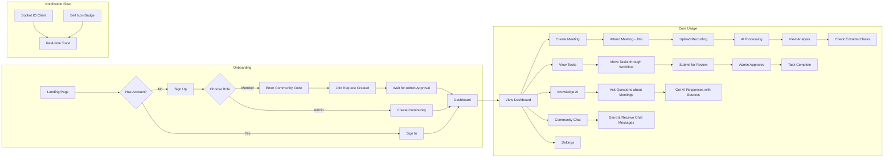

## Detailed User Flows

### 1. Registration (Member)

**Goal:** Create an account and join an existing community workspace.

**Steps:**

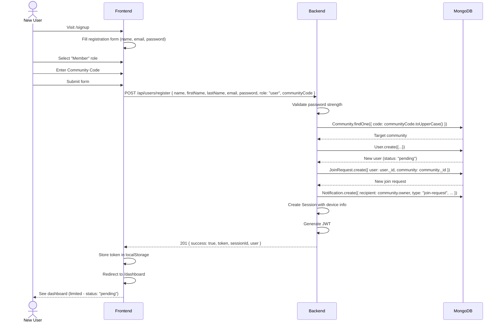

**Backend APIs Called:**
- `POST /api/users/register`

**Database Changes:**
- New User document created (`status: "pending"`)
- New JoinRequest document created (`status: "pending"`)
- New Notification to community owner

**Notifications:**
- Community owner receives `join-request` notification

**Socket Events:**
- None (notification stored; admin views on page load)

---

### 2. Login

**Goal:** Authenticate and access the dashboard.

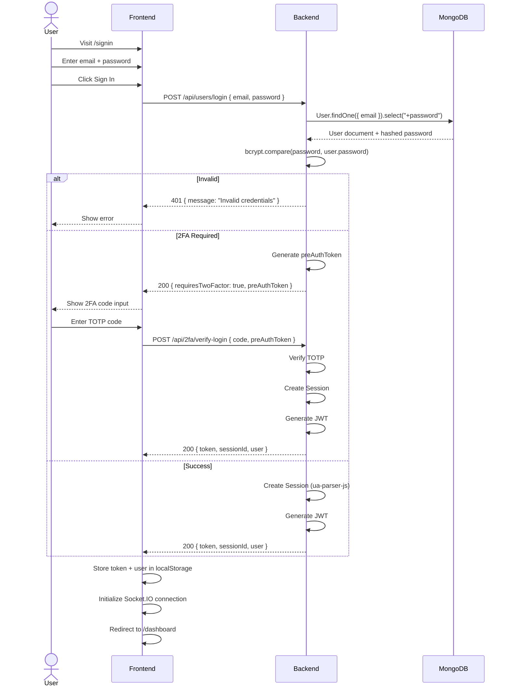

---

### 3. Dashboard

**Goal:** View weekly stats, activity chart, AI insights, pending tasks, and upcoming meetings.

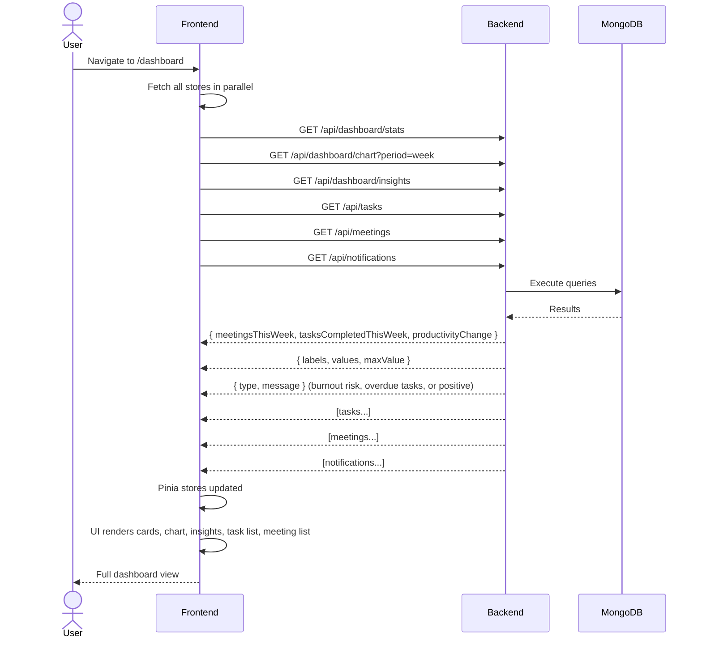

**Backend APIs Called:**
- `GET /api/dashboard/stats`
- `GET /api/dashboard/chart?period=week`
- `GET /api/dashboard/insights`
- `GET /api/tasks`
- `GET /api/meetings`
- `GET /api/notifications`

---

### 4. Create Meeting

**Goal:** Schedule a new meeting with participants.

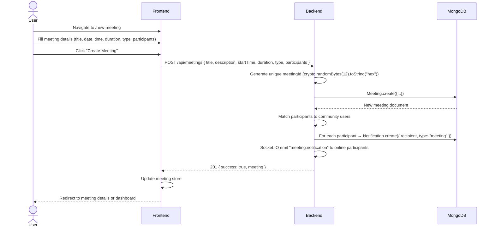

**Database Changes:**
- New Meeting document (`status: "scheduled"`)
- Multiple Notification documents (one per participant)

**Notifications:**
- Each participant receives `meeting`-type notification with meeting title, date, time, organizer

**Socket Events:**
- `meeting:notification` emitted to online participants' sockets

---

### 5. Upload Recording & Process Meeting

**Goal:** Upload a meeting recording and trigger the AI processing pipeline.

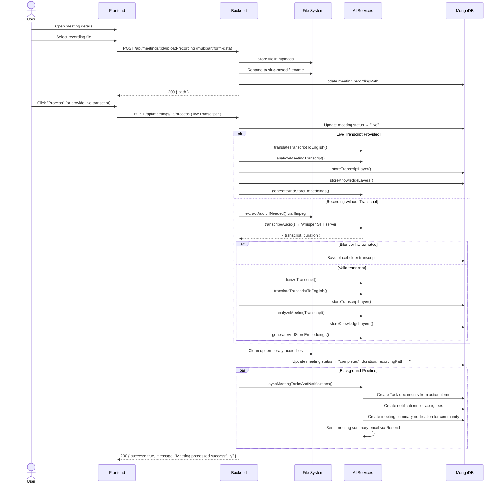

**AI Services Called:**
1. Whisper STT (Python FastAPI server on port 8001)
2. Groq Llama 3.3 (transcript translation, analysis, diarization)
3. Xenova Transformers (embedding generation)
4. Vector Store service (MongoDB + optional Pinecone/Chroma)

**Database Changes:**
- MeetingTranscript created/updated
- MeetingKnowledge created/updated
- MeetingEmbeddings created
- ActionItems replaced
- Tasks created (in background)
- Notifications created (in background)

**Notifications:**
- Task assignees notified of new tasks
- Community members notified of meeting summary

**Email:**
- Meeting summary email sent to all active community members via Resend

---

### 6. Task Management Workflow (Member)

**Goal:** Move a task through To Do → In Progress → Review with the Kanban board.

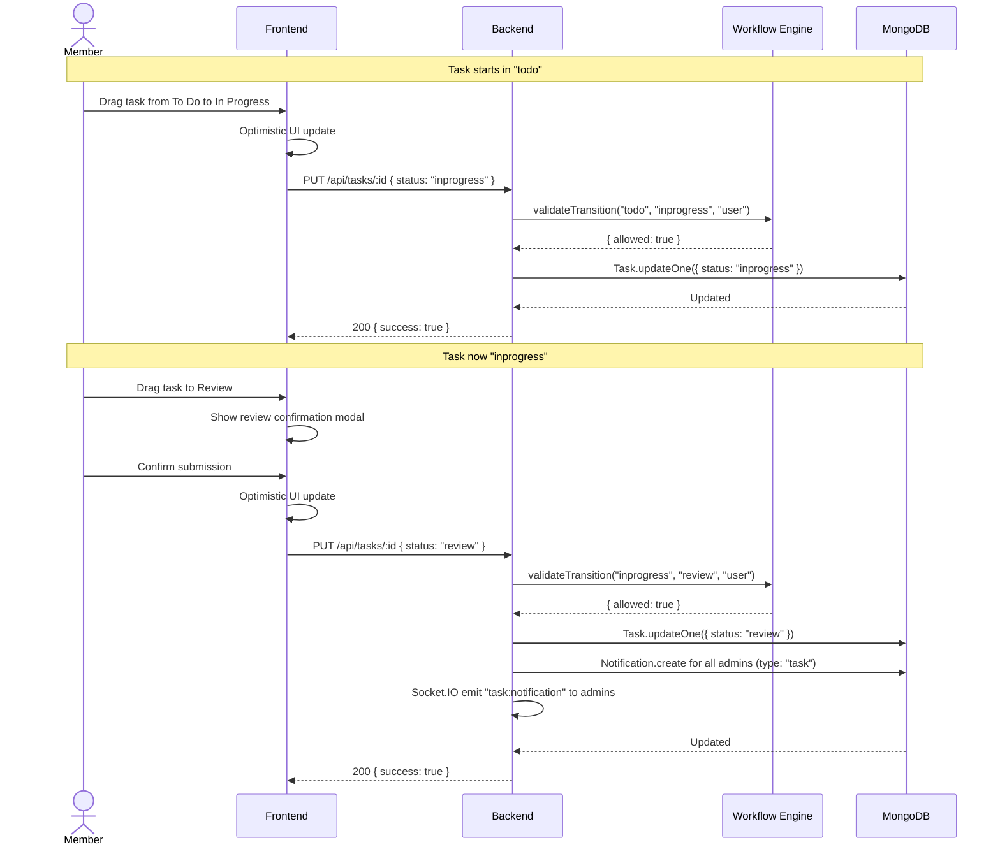

**Workflow Rules Enforced:**
- Members: todo → inprogress, inprogress → review (only)
- Members cannot: move to done, move backwards, skip stages
- Tasks in review/done are locked for members

**Notifications:**
- Admin receives "Task Ready For Review" with member name and task title

**Socket Events:**
- `task:notification` to all online admin sockets

---

### 7. Task Review Flow (Admin)

**Goal:** Approve or return a task that has been submitted for review.

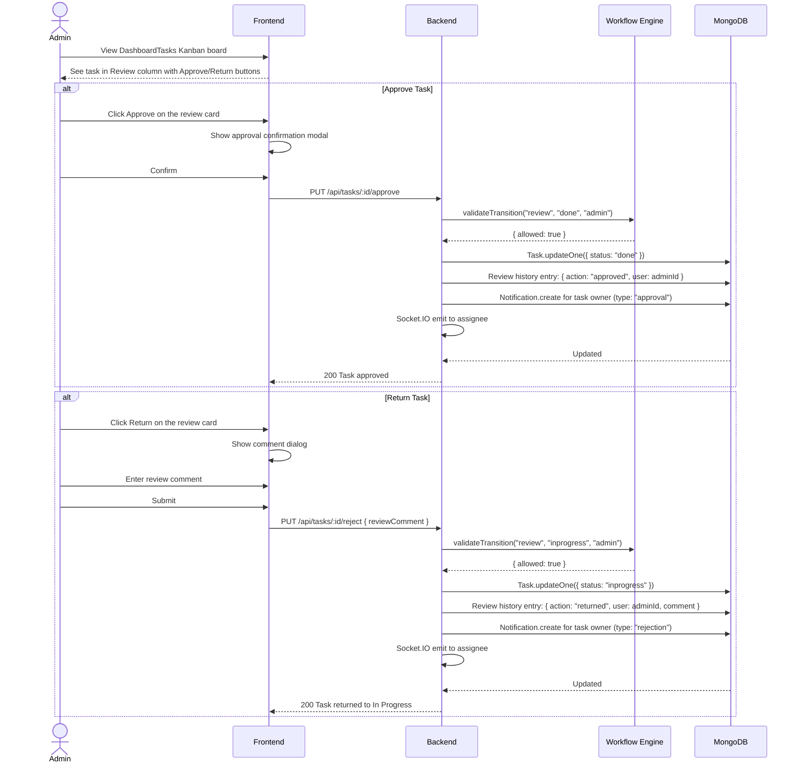

**Admin Restrictions Enforced:**
- Admin cannot change todo or inprogress tasks
- Admin cannot drag any card (uses buttons only)
- Admin can only act on review-stage tasks
- Returns go specifically to "inprogress" (not todo)
- Approval goes specifically to "done"

**Notifications:**
- Member receives "Task Approved" or "Task Returned" with admin's comment

---

### 8. Knowledge AI (RAG Query)

**Goal:** Ask natural language questions about past meetings and get AI-generated answers with source citations.

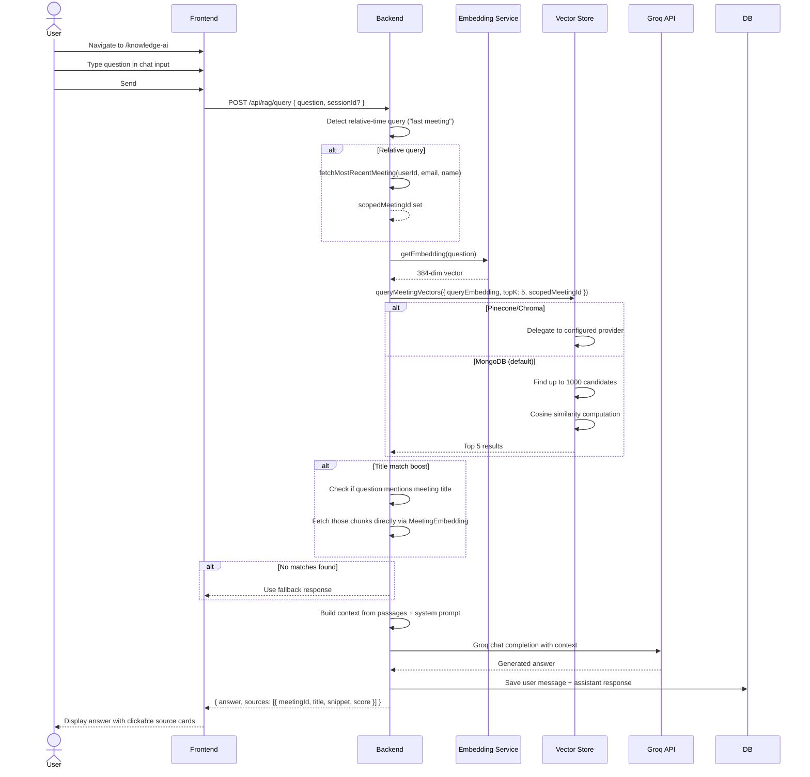

**AI Services Called:**
1. Xenova Transformers (embed query)
2. Vector Store (semantic search)
3. Groq Llama 3.3 (answer generation)

---

### 9. Community Chat

**Goal:** Send and receive real-time messages with other community members.

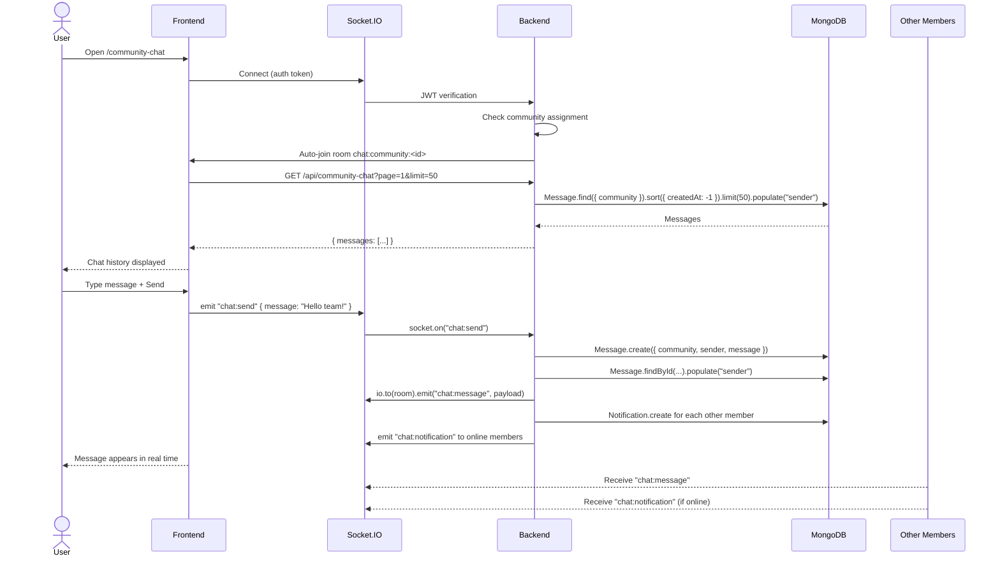

**Backend APIs Called:**
- `GET /api/community-chat` (initial load, paginated)

**Socket Events:**
- `chat:send` (client → server)
- `chat:message` (server → room)
- `chat:notification` (server → individual sockets)
- `chat:error` (server → individual)

**Notifications:**
- Each community member (except sender) receives a `chat`-type notification with message preview

---

### 10. View Meeting Analysis

**Goal:** View the AI-generated summary, decisions, tasks, and transcript of a processed meeting.

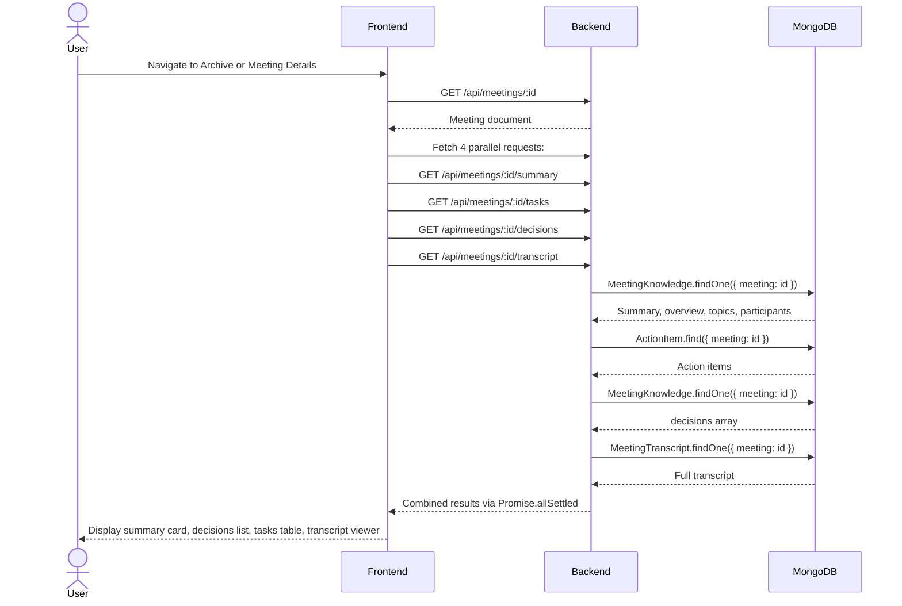

**Backend APIs Called (in parallel):**
- `GET /api/meetings/:id/summary` → `meetingKnowledgeController.getMeetingSummary`
- `GET /api/meetings/:id/tasks` → `meetingKnowledgeController.getMeetingTasks`
- `GET /api/meetings/:id/decisions` → `meetingKnowledgeController.getMeetingDecisions`
- `GET /api/meetings/:id/transcript` → `meetingKnowledgeController.getMeetingTranscript`
