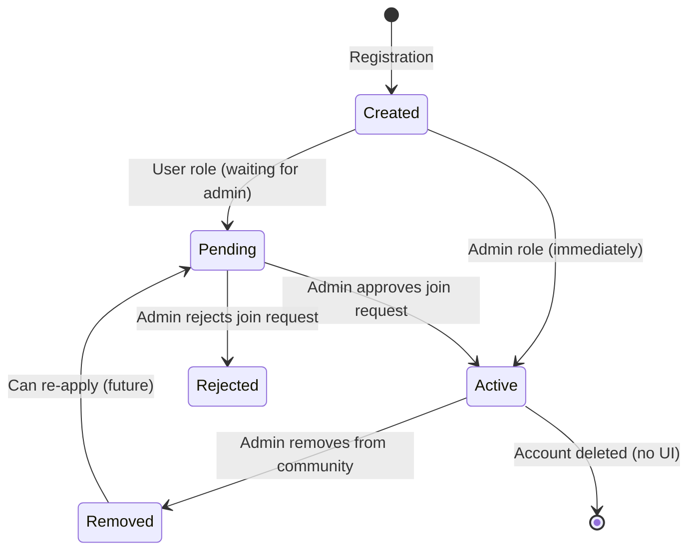

# SmartMeet — Users & Profiles

## Feature Overview

The Users module handles account creation, profile management, session tracking, notification preferences, and two-factor authentication. It is the largest controller in the backend (1117 lines) and integrates with multiple subsystems: JWT, bcrypt, Google OAuth, speakeasy, ua-parser-js, and Socket.IO.

## User Model

**File:** `Back-end/src/models/User.js`

```javascript
{
  // Identity
  name: String,                    // Full display name (required)
  firstName: String,               // First name (required)
  lastName: String,                // Last name
  email: String,                   // Unique, lowercase (required)
  password: String,                // bcrypt hashed, select: false
  avatar: String,                  // Avatar URL
  
  // Role & Community
  role: String,                    // "user" (default) | "admin"
  community: ObjectId,             // FK → Community (nullable)
  status: String,                  // "pending" (default) | "active" | "rejected"
  
  // Contact
  phone: String,
  company: String,
  jobTitle: String,
  
  // Security
  twoFactorEnabled: Boolean,       // Default: false
  twoFactorSecret: String,
  googleId: String,
  isActive: Boolean,               // Soft delete (default: true)
  
  // Auth
  lastLogin: Date,
  refreshToken: String,
  resetPasswordToken: String,
  resetPasswordExpire: Date,
  
  // Preferences
  notificationSettings: {
    summaries: Boolean,
    reports: Boolean,
    digestTime: String,
    reminderWindow: String,
    quietHours: Object,
    pushDesktop: Boolean,
    pushMobile: Boolean,
  },
  
  // Subscription
  subscription: {
    plan: String,
    price: Number,
    currency: String,
    billingCycle: String,
    renewalDate: Date,
    stripeCustomerId: String,
    status: String,
  },
}
```

**Virtuals:**
- `profileUrl` — derived profile URL
- `fullName` — concatenated firstName + lastName
- `twoFactor` — twoFactorEnabled boolean

**Instance Methods:**
- `matchPassword(enteredPassword)` — bcrypt.compare
- `getPublicProfile()` — returns user data without password, refreshToken, twoFactorSecret

**Pre-save Hook:**
- Hashes password with bcrypt (12 rounds) when modified

## User Lifecycle



## User API Endpoints

### Authentication

| Method | Endpoint | Auth | Description |
|---|---|---|---|
| POST | `/api/users/register` | None | Register (admin → creates community; user → join request) |
| POST | `/api/users/login` | None | Email/password login (with 2FA support) |
| POST | `/api/users/google-login` | None | Google OAuth login |
| POST | `/api/users/forgot-password` | None | Send password reset email |
| POST | `/api/users/reset-password/:token` | None | Reset password with token |

### Profile

| Method | Endpoint | Auth | Description |
|---|---|---|---|
| GET | `/api/users/profile` | protect | Get own profile |
| PUT | `/api/users/profile` | protect | Update profile fields |
| PUT | `/api/users/change-password` | protect | Change password (requires current) |
| POST | `/api/users/avatar` | protect, upload | Upload avatar image |

### Two-Factor Authentication

| Method | Endpoint | Auth | Description |
|---|---|---|---|
| POST | `/api/users/2fa/setup` | protect | Generate TOTP secret + QR code |
| POST | `/api/users/2fa/verify` | protect | Verify and enable 2FA |
| POST | `/api/users/2fa/disable` | protect | Disable 2FA |
| POST | `/api/users/2fa/verify-login` | None | Complete 2FA during login |

### Sessions

| Method | Endpoint | Auth | Description |
|---|---|---|---|
| GET | `/api/users/sessions` | protect | List all login sessions |
| DELETE | `/api/users/sessions/:id` | protect | Revoke a session |

### Notification Settings

| Method | Endpoint | Auth | Description |
|---|---|---|---|
| GET | `/api/users/notification-settings` | protect | Get preferences |
| PUT | `/api/users/notification-settings` | protect | Update preferences |

## Session Management

**File:** `Back-end/src/models/Session.js`

```javascript
{
  user: ObjectId,          // FK → User (required)
  refreshToken: String,    // JWT (required)
  browser: String,         // Detected via ua-parser-js
  browserVersion: String,
  os: String,
  osVersion: String,
  device: String,
  deviceType: String,      // Default: "desktop"
  ip: String,
  lastActive: Date,
}
```

Each login creates a session with device fingerprinting. Sessions are listed and revokable by the user. Socket.IO emits `session:revoked` when a session is deleted.

## Profile Photo Upload

Uploaded via Multer middleware to the `uploads/` directory. The file is renamed with a timestamp prefix and stored as a static file served by Express.

## Notification Settings

Users can configure their notification delivery preferences:

| Setting | Type | Description |
|---|---|---|
| `summaries` | Boolean | Receive daily/weekly summary emails |
| `reports` | Boolean | Receive report notifications |
| `digestTime` | String | Preferred time for digest emails |
| `reminderWindow` | String | Time window for reminders |
| `quietHours` | Object | Do-not-disturb hours configuration |
| `pushDesktop` | Boolean | Desktop push notifications |
| `pushMobile` | Boolean | Mobile push notifications |
