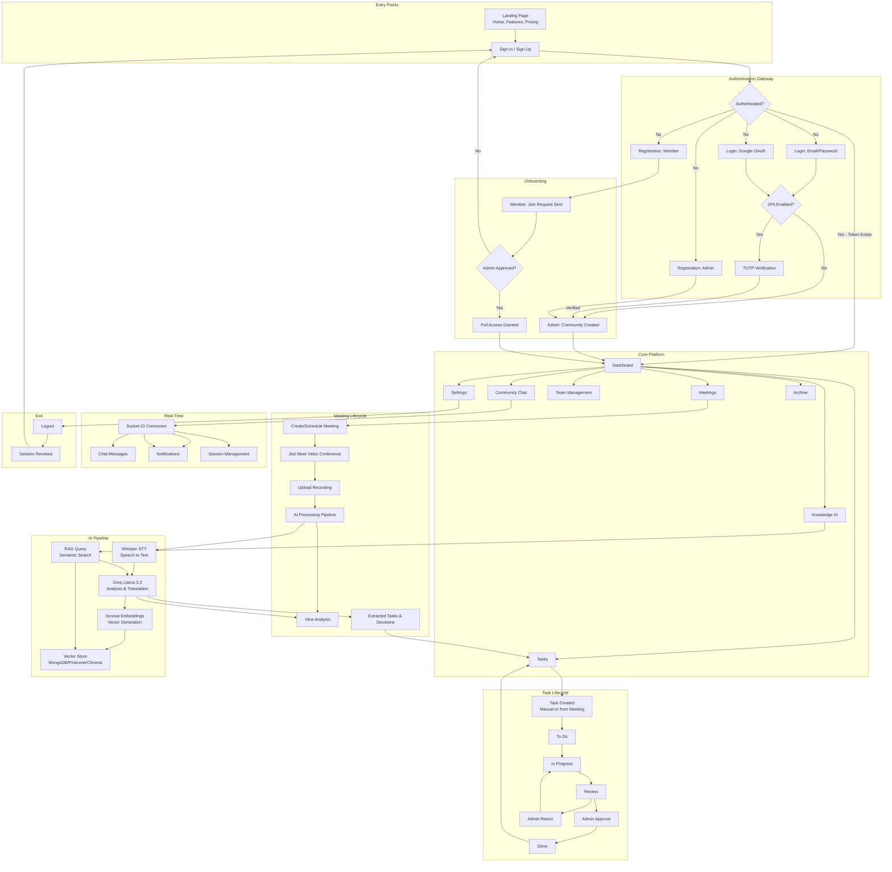
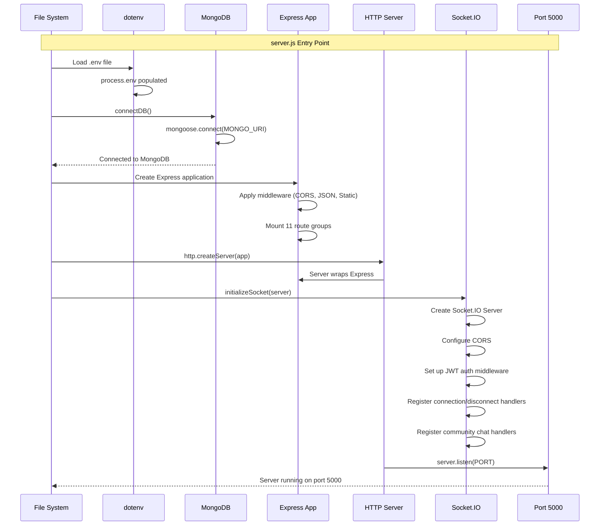
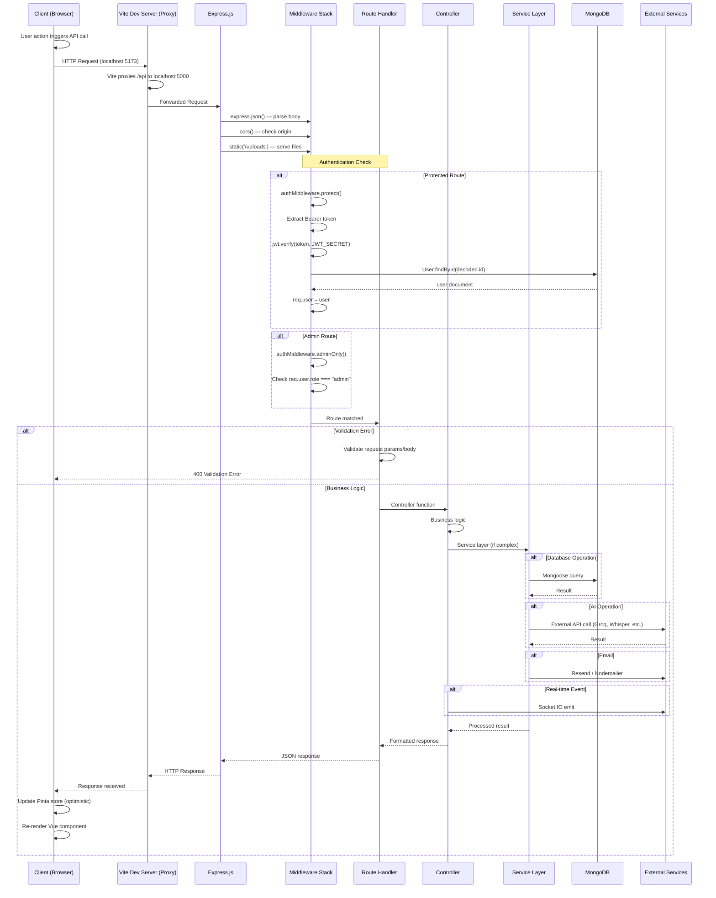
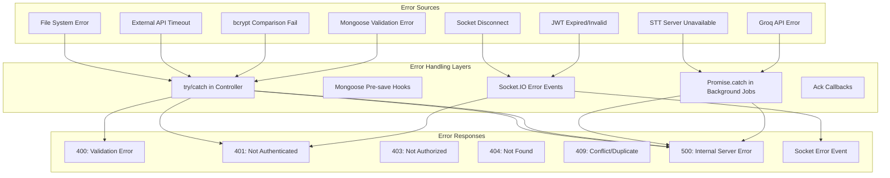

# SmartMeet — System Workflow

## Complete System Workflow Diagram



## Application Startup Flow



## Request Lifecycle



## Error Handling Flow



## System Integration Map

```mermaid
graph TB
    subgraph Frontend["Frontend (Vue 3)"]
        A1[Views + Components]
        A2[Pinia Stores]
        A3[Axios HTTP]
        A4[Socket.IO Client]
        A5[Router]
    end

    subgraph Backend["Backend (Express + Socket.IO)"]
        B1[Route Groups × 11]
        B2[Controllers × 13]
        B3[Services × 12]
        B4[Models × 17]
        B5[Middleware × 2]
        B6[Socket Handlers × 2]
        B7[Utilities × 3]
    end

    subgraph Database["MongoDB (Mongoose)"]
        C1[15+ Collections]
        C2[Indexes]
        C3[Validation]
        C4[Pre-save Hooks]
    end

    subgraph AI["AI Services"]
        D1[Whisper STT (Python)]
        D2[Groq Llama 3.3]
        D3[Xenova Embeddings]
        D4[Pinecone / ChromaDB]
    end

    subgraph External["External Services"]
        E1[Google OAuth]
        E2[Resend Email]
        E3[Gmail SMTP]
        E4[Jitsi Meet]
        E5[Paymob / Stripe]
    end

    A3 --> B1
    A4 --> B6
    B1 --> B2
    B2 --> B3
    B3 --> C1
    B2 --> B7
    B3 --> D1
    B3 --> D2
    B3 --> D3
    B3 --> D4
    B2 --> E1
    B3 --> E2
    B7 --> E3
    A1 --> E4
    A5 --> E1
    A3 --> E5
```
